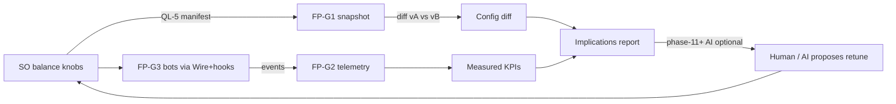

# Balance automation loop (GameLens + Wire + bots + AI)

> **Audience:** maintainer + every session that touches D11, QL-5/6, FP-G*, Wire
> playability, or phase-11+.
> **Status:** maintainer intent locked **2026-08-12** — playtests that today need a
> human should become **automated**, **seed-deterministic where possible**, with **AI
> only where judgment is required** (never as the source of a pass/fail verdict).
> **Companion docs:** [`03-FUTURE-PHASES.md`](03-FUTURE-PHASES.md) Group G,
> [`GAME-INTEGRATION.md`](GAME-INTEGRATION.md) §5, [`STATUS-DUAL.md`](STATUS-DUAL.md),
> [`02-AI-ROADMAP.md`](02-AI-ROADMAP.md), [`adr/ADR-0008-wire-v2-ui.md`](adr/ADR-0008-wire-v2-ui.md).

---

## 1. Goal

Everything that is balanced by **playtest** (economy pacing, enemy pressure, level
difficulty curve, OP/UP units/skills, …) should eventually be:

1. **Exercised** by bots (same seed → same decisions for deterministic policies).
2. **Measured** into comparable series (telemetry + session summaries).
3. **Diffed** against the config that produced them (SO snapshot).
4. **Interpreted** by AI labeled as *model reasoning*, never mixed with *measured*.
5. **Retuned** in ScriptableObjects → re-snapshot → re-run bots.

The reference game (ElJuegaso P1) must **not** build a parallel balance-tool stack —
Questline GameLens **is** that stack.

---

## 2. Closed loop

| Layer | Phase | Produces | Does **not** |
|-------|-------|----------|--------------|
| Config truth | QL-5 + **FP-G1** | Normalized snapshots + typed diffs | Playthrough proof |
| Measured truth | **FP-G2** + QL-6 | Event series, session summaries | Config authorship |
| Exercise | **FP-G3** (+ game bot suite) | N seeded runs / policy / version | Design opinions |
| Judgment | **G1 implications** (batch) + **FP-G4** (interactive agent + HUD) | Labeled priorities over measured + config diff | Verdicts; SO writes |
| Test agents | **phase-12** (after G4) | Triage / diagnose / heal failing **tests** | Balance retune |

**Hard rule (master plan §3):** AI never invents a green/red. Bots and telemetry own
the numbers; AI explains and prioritizes.

---

## 3. Balance axes (what we automate)

These are the playtest domains the maintainer wants automated. Each axis needs:
**knobs in SOs** (QL-5), **bot policies that stress them** (FP-G3), **events/KPIs**
(FP-G2), optional **AI narrative** after phase-11.

| Axis | Examples (P1) | Config (G1) | Measured (G2/G3) |
|------|---------------|-------------|------------------|
| In-level economy | Amber inflow/outflow, sinks, inter-wave boost, mid/late starvation | Economy / CombatBalance / LevelConfig | Amber curves, time-to-Nth deploy, idle amber peaks |
| Enemy pressure | HP, speed, density W2+, spawn warnings | UnitStats / wave presets / CombatBalance | Leaks, hearts lost/wave, time-to-leak |
| Level difficulty curve | Early vs mid vs late; campaign pace | LevelConfig + wave sets | Waves survived, fail wave distribution, clear time |
| Unit power (dinos / enemies) | DPS, cost, CD, resists | UnitStats + kits | Damage dealt/taken by type, pick rate under policies |
| Skills | Tax, CD, effect strength | Skills SOs | Cast rate, win delta with/without skill, economy cost |
| Opening / IEB | K-OpeningDeploy, slot caps | IEB presets + CombatBalance | Early deploy count, lanes occupied @ T |

Genre-agnostic GameLens code still groups diffs by **system tags** declared in the
manifest (economy, creatures, waves, …) — never by hard-coded P1 type names in core.

---

## 4. Recommended schedule (maintainer 2026-08-12)

**Do not wait for phase-11 or phase-13 to run bots.** Deterministic policies need Wire +
hooks + telemetry, not an LLM.

| Order | Work | Repo | Why |
|------:|------|------|-----|
| 1 | **D11** economy mid/late (knobs in SOs) | ElJuegaso | Something worth measuring |
| 1∥ | **QL-5** SO export manifest | ElJuegaso | Feeds FP-G1 |
| 1∥ | **FP-G1** snapshot + diff (**AI report deferred**) | questline | Config truth |
| 2 | **FP-G2** thin telemetry + **QL-6** event map | both | Without this, bots only leave dumps/screenshots |
| 2b | **QL-7** combat hooks (`DeployAt` / collect / `BoardState` / skill-by-cell / finite `LoadIeb`) | ElJuegaso | Unblocks G3; do not Point-spam |
| 2c | **Wire playability gate** (see §5) — **09c** only if needed | questline (+ game) | Confirm bots can complete a normal combat loop |
| 3 | **FP-G3** deterministic bots + measured curves | questline + game `automation/` | After **QL-7**. Playtest automation |
| 4 | **phase-11** AI foundation | questline | LLMPort + budget |
| 5 | FP-G1 AI implications ✅; **FP-G4** balance agent + HUD (next); later AI bot policies | questline | Use *measured* data; never replace it |
| later | **phase-12** test agents (after G4); 13 eval; D12; G3 soak | both | Scale |

**Immediate next:** **FP-G4** GameLens balance agent + HUD (retune *priorities* in the
control center; Pablo reviews the whole UI). Numbered **phase-12** (triage/healer) is
**parked** until after G4. Former 12b HUD-only brief is folded into G4. G1 implications
live report ✅. Optional: `QUESTLINE_SNAPSHOT_ID` on later bots. Do not invert
G1 → G2/G3 → 11. Brief: [`phase-fp-g4-balance-agent.md`](phases/phase-fp-g4-balance-agent.md).

---

## 5. Can Wire play the game “normally”?

### What Wire v2 already can (09b ✅)

| Capability | Enough for bots? |
|------------|------------------|
| `call_hook` / getters (`GetAmber`, `GetWave`, `BalanceSnapshot`, …) | **Yes — preferred** for state + cheats + determinism |
| `find` / `hierarchy` / `tap` (element or screen `Point`) | **Yes** for menus, buttons, tap-deploy UI |
| `screenshot` | Artifacts / AI vision later |
| Seed hooks (`SetSeed`) | Deterministic runs |

### Gaps that can block “normal” combat UX

| Gap | Risk for P1 | Mitigation (preferred first) |
|-----|-------------|------------------------------|
| No `swipe` / drag | Default deploy mode is **Drag** | Force **Tap** deploy for bot profiles; add hook `DeployAt` / select-unit if missing |
| No long-press / multi-touch | Skills / relocate UX | Prefer hooks for skill fire + target cell |
| World board vs uGUI | Point taps flaky | Cell/index hooks over raw screen coords |
| Popups / FTUE | Suite needs `HandleOptional` | Wire find/tap once locators exist |

**Verdict:** Wire **can** drive a normal *balance* playthrough **if** the game exposes
hooks (or Tap-mode UI) for deploy/collect/skill/relocate. Wire alone is **not** yet a
full gesture clone of human Drag-deploy. That is OK for GameLens KPIs; it is **not** OK
as the only proof that Drag UX feels right (human / later 09c).

### When to schedule **phase-09c — Wire play gestures**

Add **09c** (swipe / drag / long-press on Wire, still `#if QUESTLINE_DEV`) **before or
at the start of FP-G3** only if:

- bot policies must exercise **Drag deploy** (or other gestures) as part of the measured
  path, **or**
- hooks cannot cover a critical action without UI gesture.

Otherwise: **defer 09c**; ship FP-G3 hooks-first + Tap UI; keep Drag as human/feel.

Track: [`phases/phase-09c-wire-play-gestures.md`](phases/phase-09c-wire-play-gestures.md)
(brief ready; schedule when the gate fails).

---

## 6. Determinism vs AI in bots

| Bot class | When | Behavior | Data use |
|-----------|------|----------|----------|
| **Deterministic policies** | FP-G3 (now path) | Locked catalog (game §11): `balanced`, `cheapest`, `rush`, `never_skill`, `always_skill` + collector-first kernel | Primary measured curves |
| **AI policies** | After phase-11 (+ optional 12) | LLM/tool loop chooses actions under budget | Compare vs deterministic baseline; never sole acceptance |
| **Hybrid** | Later | Deterministic scaffold + AI only on ambiguous choices | Same framing rules |

Always: fixed `SetSeed`, fixed policy id in telemetry context, N repeats, store
`policy` + `game_version` + `config_snapshot_id`.

---

## 7. Session prompts & dual updates

Starter prompts for the joint wave live in
[`phases/SESSION-PROMPTS-D11-QL5-FPG1.md`](phases/SESSION-PROMPTS-D11-QL5-FPG1.md)
(historical) and [`phases/SESSION-PROMPTS-QL6-FPG3.md`](phases/SESSION-PROMPTS-QL6-FPG3.md)
(QL-7 then G3) and [`phases/SESSION-PROMPTS-G4-BALANCE-AGENT.md`](phases/SESSION-PROMPTS-G4-BALANCE-AGENT.md)
(FP-G4). Every PR that changes this order must update [`STATUS-DUAL.md`](STATUS-DUAL.md) §4
(Mermaid + suggested order table).

---

## 8. Decision log

| Date | Decision |
|------|----------|
| 2026-08-12 | Closed-loop balance automation is a first-class goal; GameLens owns it. |
| 2026-08-12 | Order: D11+QL-5+FP-G1 → **FP-G2/QL-6** → **FP-G3 bots** → **phase-11 AI** (not AI before bots). |
| 2026-08-12 | FP-G1 AI report deferred until phase-11; snapshot/diff ship without LLM. |
| 2026-08-12 | FP-G3 no longer waits on phase-13; AI bot policies are a later add-on. |
| 2026-08-12 | **Maintainer lock:** first bots use **Tap deploy + hooks** (not Drag / not 09c unless gate fails). That is the measured “normal combat loop” for GameLens; human Drag feel stays playtest/manual. |
| 2026-08-12 | **Maintainer lock:** ship **real thin FP-G2/QL-6** before bots (no Dump-only long-term hack). |
| 2026-08-12 | **Maintainer lock:** first bot *target levels* = **IEB Pass B presets B1–B5** (policy details TBD at FP-G3). |
| 2026-08-12 | **Maintainer lock:** before FP-G3, add missing combat hooks if needed (`DeployAt` / select-unit / fire-skill / collect) rather than screen-Point spam. |
| 2026-08-12 | **Maintainer lock:** phase-11 **after** first bot dataset (serial), not in parallel with G2/G3. |
| 2026-08-12 | Wire v2 + hooks sufficient for first bots if Tap/hooks cover combat; 09c only if gesture gap blocks. |
| 2026-08-12 | QL-6 / FP-G2 pulled forward (not only with D12); D12 still consumes richer telemetry. |
| 2026-08-13 | **FP-G2 landed:** thin telemetry + ADR-0010; HUD view deferred. Later event names reserved in `FUTURE_EVENT_NAMES` (D12 / G2+). |
| 2026-08-13 | **QL-6 landed (game):** thin emit + Editor spool import. Checkpoints actually emitted: `post_3_deploy`, `between_wave`, `prep_end`, `end` (no `mid_w*`). IEB does not auto-seed `P1Rng`. ∞Ám omits spends. Mapping: ElJuegaso `integracion-questline.md` §10. |
| 2026-08-13 | **G3 policies locked** (game §11): shared kernel (collector-first, finite amber, collect pickups) + `balanced` / `cheapest` / `rush` / `never_skill` / `always_skill`. `balanced` = if/then on `BoardState` getters, not LLM, not extra telemetry. Buff pick **per policy**. Repair off in v1. Matrix DoD = B1–B5 × 5 policies × N=3. **QL-7 before FP-G3.** Do not add `enemy.spawn` for bots (D12). |
| 2026-08-14 | **FP-G3 suite landed** in ElJuegaso `automation/bots` (fake-driver CI + live markers). Buff v1 = `SkipBuffDraft` for all policies (`BoardState` has no offer list). Playability gate: **hooks sufficient**; 09c stays parked. HUD telemetry view still **deferred** (CLI `questline telemetry`). Live Editor matrix remains maintainer-checked DoD. |
| 2026-08-14 | **INC-0009:** hatch `force-include` of HUD static duplicated `index.html` in the wheel; `uv run` from ElJuegaso `automation/` (git pin) failed before pytest. Drop the duplicate include; live commands use `uv run --no-sync` after `uv pip install -e D:\dev\questline`. |
| 2026-08-14 | **G3 live lock:** Support/Trampero are not lane cover. Cover = Dientes/Veloz/Armadura/Volador/Cuello. Support only behind Armadura (else most-damaged cover). Trampero may sit on an already-covered lane. Cheapest never uses skills. |
| 2026-09-09 | **FP-G3 live DoD:** Editor matrix 75/75 passed (~1h48). All sessions `outcome=lose`, `snapshot=snap-unset`. Watchdog thread warning on `3-balanced-44` (INC-0010, run still green). Next = phase-11. |
| 2026-09-09 | **phase-11 landed:** LLMPort + ProviderRouter + hard budgets + `ai_calls` (migration 5) + versioned prompts + doctor ping + HUD cost table. Thin GameLens `--ai` consumer (measured vs model reasoning; no imputation). **Not** design copilot / AI bot policies. Immediate next = G1 implications live report (and/or 12). |
| 2026-09-10 | **phase-11 live smoke:** Groq (`openai/gpt-oss-20b`) + Ollama (`llama3.2`, cost 0) verified. **Mistral postponed** (no La Plateforme key). Not a merge blocker. |
| 2026-09-10 | **G1 implications live report:** persist `artifacts/lens/<a>__<b>/implications.json` + `.md` and `lens_implications` (migration 6). `snap-unset` / NULL sessions go to `unjoined` (never a silent `game_version` join). `combat.damage` and other `FUTURE_EVENT_NAMES` stay gaps. **Maintainer live (fixtures):** Groq (`ai_groq`) produced usable *model reasoning* over pack-a→pack-b (`session_count=0` — `.questline-tmp-lens.db` has no G3). Ollama `llama3.2` completed the path but confused gaps with missing KPIs — prefer Groq for implications; Ollama remains a zero-cost smoke. **Mistral** still deferred. HUD GameLens/telemetry panels scheduled as **phase-12b after phase-12** (Pablo full-HUD review). Phase-12 is test agents, not a retune copilot (FP-G4 later). |
| 2026-09-10 | **Maintainer reorder:** Immediate next = **FP-G4** (balance agent + HUD). Numbered **phase-12** parked until after G4. **12b folded into G4**. HUD-first lock: new operator phases ship HUD in the same PR (PowerShell is extra). The agent proposes retune *priorities* only — never writes SOs, never invents green/red. |
