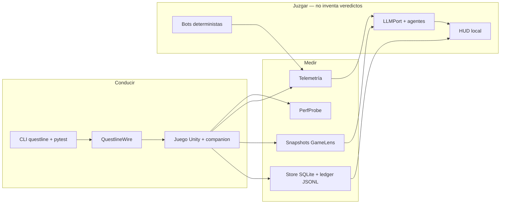
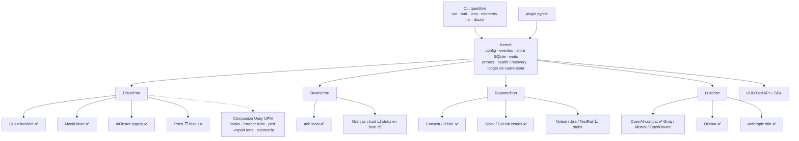
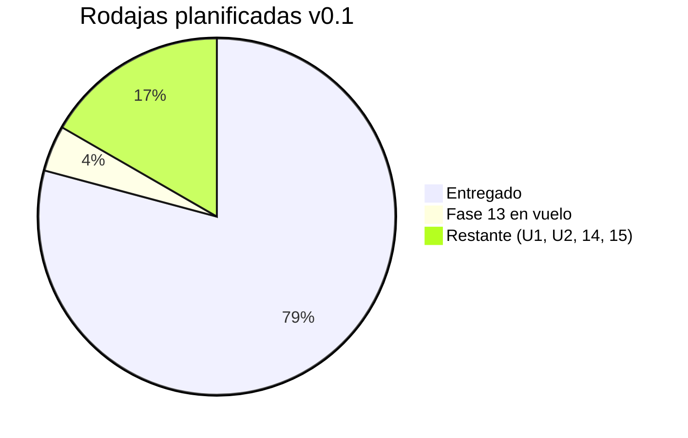
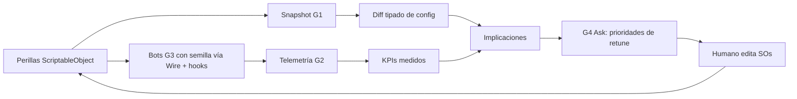

# Questline — Briefing del proyecto

**Público:** gente que no vive en este repo — colaboradores, estudios, inversores, o
cualquiera que pregunte “qué es esto, qué funciona hoy y por qué debería importarme”.
**Idioma:** español. Versión inglesa: [`PROJECT-BRIEFING.md`](PROJECT-BRIEFING.md).
**Fecha:** 2026-09-21.
**Tablero operativo (maintainer):** [`STATUS-DUAL.md`](STATUS-DUAL.md).
**Este documento:** una foto para presentar. No sustituye los briefs de fase.

### Cómo abrir este archivo fuera de Cursor

Este `.md` es un documento normal del repo. Ruta:

`D:\dev\questline\docs\PROJECT-BRIEFING.es.md`

| Dónde | Qué verás |
|-------|-----------|
| Explorador de Windows + Bloc de notas / Word | Texto plano. Word no dibuja los diagramas Mermaid. |
| VS Code, Typora, Obsidian, Mark Text | Preview Markdown. Mermaid suele verse si la app lo soporta (en VS Code: extensión “Markdown Preview Mermaid Support”). |
| GitHub / GitLab (cuando el commit esté en el remoto) | Tablas + diagramas Mermaid en el navegador. La forma más fácil de **enviar el enlace** a otra persona. |
| [mermaid.live](https://mermaid.live) | Pega un bloque ` ```mermaid ` para exportar PNG/SVG de un diagrama. |

El **canvas** de Cursor (panel interactivo al lado del chat) **no** se abre fuera de Cursor:
vive en una carpeta de la IDE, no es un PDF ni una web. Para enseñar a terceros usa este
Markdown (o GitHub).

---

## 1. Pitch de una página

**Questline** es un framework open-source de **automatización de tests para juegos, nativo
en IA**, Unity primero. Python + pytest, licencia MIT, validado contra un juego Unity real
en prototipo (tower defense + cría de criaturas). El paquete es `questline` (Python 3.11+).
La versión en disco es **0.1.0**; aún no hay release público v0.1.0.

La mayoría de herramientas de automatización de juegos se quedan en “pulsa este botón”.
La mayoría de IA de testing se queda en el DOM web. Questline está pensado como **un solo
stack** que un estudio pequeño puede ejecutar de verdad:

1. **Conducir** el juego con un protocolo local barato (QuestlineWire), no un broker de
   escritorio de pago.
2. **Medir** rendimiento, telemetría de gameplay y diffs de config de balance.
3. **Ejercitar** el balance con bots deterministas (misma semilla → mismas decisiones).
4. **Explicar** con IA — etiquetado *model reasoning*, nunca mezclado con números medidos.
5. **Mantener tests** con agentes con puertas (triage, diagnosticar, curar, generar) cuya
   afirmación “ya pasa” **nunca** es el veredicto. El runner vuelve a ejecutar y parsea.

La regla de diseño no negociable: **la IA no inventa verde ni rojo.** Los artefactos
poseen los números. Eso es el producto, no un eslogan.



---

## 2. Qué es, y qué no es

| Sí es | No es |
|-------|--------|
| Un **framework** (librería + plugin pytest + CLI + HUD) | Un SaaS alojado ni una nube multi-usuario |
| Núcleo **agnóstico de género** (sin nombres de tipos del juego de referencia en `src/questline`) | Un producto Unreal / Godot terminado |
| Unity primero, **Editor + Android** en vivo | iOS en dispositivo (el puerto está listo; el hardware no) |
| Local-first (`questline hud` en el navegador) | Un reemplazo del Editor de Unity ni de los SOs que escribe diseño |
| IA que **propone** (prioridades de retune, diffs de locators, borradores de test) | Un agente que publica o marca un build como “bueno” |

**Driver live del happy path:** `driver = "questline"` (QuestlineWire — TCP + NDJSON).
**CI / unit:** `mock`. **UI remota legacy:** AltTester (Desktop **no** es el camino €0).
**Segundo backend de UI:** Poco — diseñado, **no entregado** (fase 14).

---

## 3. Arquitectura (cómo encajan las piezas)

Todo lo importante es un **port** (interfaz) con adaptadores intercambiables. Cambiar
driver, dispositivo, reporter o LLM es un cambio de perfil en `questline.toml`, no un
rewrite.



**Modelo de authoring:** pages + locators (`locators.yaml` → accessors tipados generados) +
waits explícitos **probe vs deadline** + un **ledger de cuarentena** (entrar/salir son
operaciones con herramienta, no tests comentados).

**Modelo de verdad:** cada run appendea eventos de forma incremental. Un proceso que muere
conserva todo lo anterior. Los fallos se clasifican `infra | test | authoring | unknown`.
Etiquetar un blip de adb como test rojo del juego se trata como el asesino nº 1 de
confianza en este dominio.

---

## 4. Qué hay ya construido

Foto de [`STATUS-DUAL.md`](STATUS-DUAL.md) el **2026-09-21**. “Entregado” = mergeado
(o, para la fase 13, implementado en el PR actual y dogfoodeado en HUD).

### 4.1 Fases del framework (questline)

| Área | Estado | Qué puedes hacer de verdad |
|------|--------|----------------------------|
| Bootstrap, kernel, driver port, authoring | ✅ | Suites pytest, perfiles, MockDriver en CI, locators, steps, cuarentena |
| QuestlineWire MVP + v2 UI | ✅ | Editor + Android: hooks, find, hierarchy, tap, screenshot |
| Resiliencia | ✅ | Health, escalera de recovery, watchdog, veredictos infra vs test |
| Reporters | ✅ | Consola, HTML, Slack, GitHub Issues (campos en allow-list) |
| HUD I + II | ✅ | Historial, eventos live, launch, cuarentena, perfiles, gráficas de perf |
| PerfProbe | ✅ | Series FPS / mem / CPU / batería, asserts de umbral, compare en HUD |
| GameLens G1 | ✅ | Snapshot de balance + diff tipado + informe de implicaciones (medido vs reasoning) |
| Telemetría G2 | ✅ | Ingesta thin de eventos, summaries de sesión, CLI `telemetry` |
| Bots deterministas G3 | ✅ | Matriz live Editor **75/75 passed** (~1h48). Todas las celdas **lose** — dificultad medida, no un bug del bot |
| Fundación IA (11) | ✅ | LLMPort, presupuestos, ledger de coste, Groq + Ollama live; smoke Mistral aplazado |
| Agente de balance + HUD (G4) | ✅ | Explorar snapshots/diffs/sesiones; Ask propone **prioridades de retune**, nunca escribe SOs |
| Agentes de test (12) | ✅ | Triage, maintainer (diagnose/fix + gate), healer de locators |
| Generación + eval (13) | 🔧 este PR | Spec → pytest con gate de collect/execute; unit-gen; harness golden; HUD **Generate** + **Eval** |
| Sidecar Unity CLI (U1/U2) | ⬜ catálogo | Después de 12; **no** sustituye Wire |
| Poco + Unity Test Framework (14) | ⬜ | Segundo adaptador de UI + resultados C# en el mismo store |
| Integraciones y release (15) | ⬜ | CIPort, stubs de granjas, docs site, tag **v0.1.0** |
| Gestos Wire (09c) | ⬜ aparcado | Swipe/drag solo si los bots no pueden acabar combate sin ellos. Gate actual = hooks bastan |

**Progreso hacia el v0.1 planificado** (19 entregados / 1 en vuelo / 4 restantes; 09c
aparcado y no cuenta):



### 4.2 Juego de referencia (ElJuegaso P1) — dogfood, no el producto

El framework está probado contra un prototipo Unity privado. Los nombres del juego se
quedan en el repo del juego. El contrato es [`GAME-INTEGRATION.md`](GAME-INTEGRATION.md).

| Trabajo de juego | Estado |
|------------------|--------|
| Proto D hasta D11 (código) | ✅ — el **playtest de feel** D11 sigue abierto |
| Companion + Wire Editor/Android | ✅ |
| Contadores perf, manifiesto SO, telemetría, hooks de combate | ✅ QL-3, QL-5, QL-6, QL-7 |
| Suite de bots en `automation/bots` | ✅ consumida por G3 |
| Modo infinito (D12), FTUE (D13+) | ⬜ |
| Poco + UTF (QL-4), Unity CLI + Pipeline (QL-8) | ⬜ |

### 4.3 HUD — lo que ve un visitante

Centro de control local (`questline hud`, por defecto `http://127.0.0.1:8741/`). Páginas:

| Página | Trabajo |
|--------|---------|
| Runs / Live | Historial, death-point, artefactos; eventos en streaming |
| Launch | Arrancar/parar pytest contra Editor, Android o mock |
| Quarantine / Profiles | Ledger + `questline.toml` (los secretos nunca van en el archivo) |
| Perf | Superponer FPS/memoria entre runs |
| GameLens | Snapshots, diffs, sesiones de telemetría, Ask |
| Generate | Spec en lenguaje natural → pytest + gate de collect + launch live opcional |
| Eval | Puntuaciones del agente: accuracy de diagnóstico, tasa false-green, coste |
| Trends | Pass rate y tests flaky en el tiempo |

El texto de IA en la UI se etiqueta **model reasoning**. Los números salen del store.

### 4.4 El bucle de balance (el módulo original)

Esta es la pieza que no existe como un solo producto en AltTester, Airtest o el QA web con IA.



Resultado live de G3 que un outsider debe oír claro: **75 runs, todos lose**. El framework
hizo su trabajo. El juego sigue demasiado difícil (o los bots demasiado débiles) en las
políticas medidas. El retune es decisión de **juego**; Questline mostrará el delta tras el
siguiente snapshot.

Huecos de medición (honestos): `config_snapshot_id=snap-unset` en esa matriz (el join a G1
está incompleto si no se pone `QUESTLINE_SNAPSHOT_ID`); KPIs reservados como
`combat.damage` están catalogados, no rellenados hasta eventos posteriores del juego (D12).

---

## 5. Cómo se cierra la IA (por qué esto no es una demo)

| Agente | Entrada | Salida | Puerta |
|--------|---------|--------|--------|
| GameLens Ask | Snapshot + diff + summary de telemetría | **Prioridades** de retune | Nunca verde/rojo; nunca escribe SOs; KPIs que faltan se quedan **gaps** |
| Triage | Run terminado | Clusters de fallo, infra vs test vs juego | Solo lectura |
| Maintainer | Test que falla + artefactos | Diagnóstico o parche | **Re-run parsea pytest** — el “passed” del modelo se ignora |
| Healer | `ElementNotFound` + hierarchy | Diff sugerido de `locators.yaml` | El humano aprueba |
| Generator | Spec Markdown | Nuevo `test_gen_*.py` | El archivo debe **collect** (y ejecutar donde se afirma); nunca pisa un archivo de suite existente |
| Eval harness | Tests rotos golden (MockDriver) | Accuracy, false-green, coste, iteraciones | Un golden de sabotaje debe marcar false-green |

Coste: cada intento LLM (incluido HTTP 429) es una fila en `ai_calls`. Los presupuestos
son paradas duras. Los providers se cambian porque los free tiers rotan.

---

## 6. Qué falta

### 6.1 Hasta un v0.1.0 honesto (siguiente en la pista numerada)

| Orden | Trabajo | Por qué le importa a un outsider |
|------:|---------|----------------------------------|
| Ahora | Cerrar / mergear **fase 13** | “Tenemos agentes **y** podemos puntuarlos.” El artefacto de portfolio más fuerte. |
| Paralelo (juego) | Playtest feel D11; snapshot id opcional en bots; **QL-8** Unity CLI opcional | Junta los números de G3 a una versión de config; el ciclo de vida del Editor es menos ritual |
| Siguiente framework | **FP-U1** sidecar Unity CLI (ensure Editor + chip HUD) | Quita “¿Unity está en Play?” como conocimiento tribal |
| Luego | **Fase 14** Poco + ingesta UTF | Demuestra que el swap de driver es real; los unit C# aterrizan en el mismo HUD |
| Luego | **Fase 15** CIPort, stubs de granjas, docs site, tag PyPI | Producto instalable, no solo un clone |

**No arrancar** 09c ni la fase 14 desde un slice aleatorio. El orden está documentado a
propósito.

### 6.2 Después de v0.1 — catálogo de alto valor (no programado)

De [`03-FUTURE-PHASES.md`](03-FUTURE-PHASES.md) y [`FEATURE-PIPELINE-PLAN.md`](FEATURE-PIPELINE-PLAN.md):

| Tema | Ejemplos | Por qué ayudaría |
|------|----------|------------------|
| Plataforma | CI iOS simulator, diálogos OS con Appium, instaladores Tauri del HUD | Alcance y “parece un producto” |
| Tipos de test | Matriz save/load, visual regression, monkey/soak, localización, mocks IAP, API/OpenAPI | Ciclo de vida completo de un juego, no solo smoke de combate |
| Autonomía | `questline mcp`, pipeline nightly de triage, healer auto-PR **después** de umbrales de eval | Agentes que trabajan mientras duermes — solo si eval dice que se lo han ganado |
| Feature pipeline | git-diff scan → plan de cobertura → generar unit/e2e/balance-watch | “Cada feature sale con tests” como bucle, no como esperanza |
| Balance+ | Nombres de telemetría más ricos, **políticas** de bot IA vs baselines deterministas, búsqueda de parámetros | De “los bots pierden” a “busca en las perillas” |

### 6.3 Deuda pequeña pero real (backlog)

- Faltan `.meta` de Unity → el import git UPM del companion es torpe (los juegos copian/embeben).
- `mypy` aún no es gate de CI.
- El camino probe-budget de `wait_for` está incompleto respecto al doc de arquitectura.
- No hay command palette en HUD; no hay APK de muestra en el repo.
- Notion/Jira/TestRail y adaptadores de granjas son stubs o extras vacíos.
- **INC-0010** (watchdog `pytest.exit` desde un hilo durante la matriz live) sigue **abierto**.
- Smoke live de Mistral sigue aplazado (Groq + Ollama verificados).

---

## 7. Debilidades (revisión interna, dichas en claro)

Estas son las preguntas que debería hacer un ingeniero o un producer escéptico. Las
respuestas son actuales, no aspiracionales.

### Producto y prueba

1. **Un juego de dogfood, un maintainer, Windows primero.** Agnóstico de género es una
   regla de código, no una prueba multi-estudio. Unreal/Godot/iOS no son productos.
2. **“Fácil cambiar de driver” es cierto en arquitectura, flojo en empiria.** El happy
   path live es Wire. Poco es un extra vacío. AltTester es legacy. Hasta la fase 14, la
   conformance suite es la evidencia más fuerte de la afirmación, no un segundo stack de
   UI live.
3. **v0.1.0 no está publicado.** No hay docs site, no hay workflow PyPI al estilo fase 15,
   el README es un quickstart de maintainer. Difícil evaluar sin clonar.
4. **El HUD es solo local.** Bien para un estudio solo; un lead de QA acostumbrado a
   dashboards de BrowserStack no verá usuarios, scheduling ni RBAC.
5. **Generate/eval son jóvenes.** Cuatro incidentes (INC-0011–0014) el 2026-09-21:
   fallback silencioso a MockDriver, archivo de salida incorrecto, Groq 429, import de
   fixture malo. Las puertas existen porque exactamente esta clase de bug es la que
   publican las demos de IA.

### Balance y bots

6. **G3 demuestra que el bucle funciona; aún no demuestra un juego retuneado.** Todo-lose
   es dato valioso. Sin `QUESTLINE_SNAPSHOT_ID` y el feel de D11, la historia “causa →
   efecto” está incompleta.
7. **La telemetría es thin a propósito.** Damage, proyectiles, crecimiento de ranch son
   nombres reservados. La IA no debe inventarlos. Esa honestidad es una fortaleza *y* un
   hueco frente a suites de analytics.
8. **No hay búsqueda de parámetros / grid en cloud.** El estilo Unity Game Simulation
   (“1.700 minutos en 30”) no está aquí. N=3 × 5 políticas es una matriz de estudio, no
   una economía Monte Carlo.
9. **Los bots son centrados en hooks.** Es la decisión correcta para determinismo, pero
   “juega como un humano” (drag-deploy, gestos) está aparcado. Jugar solo con imagen /
   visión no es el camino.

### IA

10. **Los goldens de eval usan MockDriver, no fallos live de Unity.** Correcto para CI;
    subdeclara “los agentes funcionan en mi juego publicado”. El eval live del maintainer
    sigue siendo una checklist humana.
11. **Coste LLM y rate limits son riesgo operativo.** Un Groq 429 ya rompió el UX de
    Generate una vez. Los mapas free-tier rotan (el apagado de Llama 3.3 70B está en el
    roadmap de IA). La abstracción es supervivencia; la fiabilidad no es gratis.
12. **El healer es solo sugerencia.** Bien. Los competidores publican heals silenciosos
    en runtime que esconden bugs de producto. Questline no debe copiar eso a ciegas.
13. **Aún no hay servidor MCP.** Cursor/`unity mcp` es otro objeto (Editor). Quien vive
    en IDEs agénticos pedirá `questline mcp` (catálogo FP-A1).

### Ingeniería

14. **Empaquetado del companion.** Sin `.meta` no hay install UPM git limpio.
15. **El ciclo de vida del Editor sigue siendo conocimiento tribal** hasta U1
    (`ensure-editor`).
16. **Watchdog INC-0010** es un warning que parece aceptable sobre una matriz verde — el
    tipo de issue que muerde el CI nocturno más tarde.
17. **Los docs son excelentes para agentes, pesados para humanos.** STATUS-DUAL es denso.
    Este briefing existe porque el repo aún no tiene landing para outsiders (eso es fase
    15).
18. **El modelo de seguridad encaja con local-first.** Las allow-lists en exporters son
    reales. No hay threat model multi-tenant porque no hay producto multi-tenant.

Nada de esto es secreto. Varias cosas ya están en [`BACKLOG.md`](phases/BACKLOG.md) e
[`INCIDENTS.md`](INCIDENTS.md) (14 incidentes; 13 fijos, 1 abierto).

---

## 8. Herramientas parecidas — y qué copiar

Questline no compite con un solo producto. Está en tres mapas a la vez: **drivers de UI
de juego**, **perf / dispositivo** e **IA de calidad**. El movimiento interesante es
quedarse pequeño y robar *mecanismos*, no clonar SaaS.

### 8.1 Automatización de UI y motor

| Herramienta | Qué es | Dónde Questline ya se diferencia | Copiar / incorporar |
|-------------|--------|----------------------------------|---------------------|
| **AltTester** | Instrumentación Unity, API rica de objetos, Desktop comercial | Wire es el happy path €0; AltTester se queda como adaptador legacy | Get/set de properties de componente; input más rico (swipe, multi-touch) cuando se desaparque 09c; **no** revivir Desktop como default |
| **Airtest + Poco** (NetEase) | Python, hierarchy + **imagen/OCR**, IDE, Unity/Cocos/nativo | La fase 14 *es* Poco como segundo backend; aún no hay recorder IDE | **Visor de hierarchy** para authoring de locators; fallback de imagen para popups no instrumentados; APIs de drag; evidencia HTML estilo Airtest |
| **GameDriver** | De pago Unity/Unreal, asserts de estado de motor | Open-source, hooks-first, GameLens encima | Adaptador Unreal **más tarde**; asserts de **estado de gameplay** de primera (Questline ya prefiere hooks a píxeles — hay que decirlo en docs) |
| **Unity Test Framework** | C# Edit/Play Mode in-engine | Ingesta planeada en fase 14 | Pipeline `run_tests` vía U1; un HUD para Python + C# |
| **Unreal Gauntlet / UAT** | E2E de build empaquetado a escala de estudio | Fuera de alcance | Solo el patrón: “sesión empaquetada + logs + soak” como historia futura de granja |
| **Agente QA AWS Bedrock** (blog 2026) | Casos NL → bucle AltTester en Device Farm; ~0,20 $/test | Questline ya tiene hierarchy, tools, traces HUD, **y** prohíbe que el modelo llame `verify(passed)` como verdad | **Perceive–reason–act–reflect** para un agente *jugador* (post G3); **knowledge base** de docs del juego; pase de discovery que cataloga interactables; helpers espaciales (`toward` / `away_from`). Mantener la regla de veredicto — el `verify()` de la demo AWS es el anti-patrón que rechazamos |

### 8.2 Rendimiento, granjas, CI

| Herramienta | Copiar / incorporar |
|-------------|---------------------|
| **GameBench / PerfDog / UWA** | HUD de dispositivo one-click: GPU, térmico, red, drenaje de batería. PerfProbe es la semilla; tendencia soak + anomalía (catálogo) es el hueco |
| **BrowserStack / BitBar / Firebase Test Lab / AWS Device Farm** | Stubs de fase 15 → un trial validado. Device Farm + Wire es cómo corrió el agente AWS en hardware |
| **game-ci** | Recetas documentadas de licencia Unity + batchmode; encaja con fase 15 y U1 `unity install` |

### 8.3 Inteligencia de balance y diseño (los pares reales de GameLens)

| Herramienta | Copiar / incorporar |
|-------------|---------------------|
| **Unity Game Simulation** (preview / grid cloud) | Bot headless + **counters** + agregados de dashboard + grid de parámetros. Questline tiene bots + telemetría + HUD; falta **búsqueda** (miles de combos) y escala headless |
| **Machinations** | Grafo visual de economía; **optimizador bayesiano** de perillas. No convertirse en herramienta de diagramas — opcionalmente **exportar** snapshots G1 a un grafo de diseño, o un modo acotado “proponer rangos numéricos” que sigue sin escribir SOs |
| **Unity ML-Agents** | Más adelante **políticas aprendidas** comparadas con baselines deterministas G3 — ya esbozado como “políticas de bot IA”, no un reemplazo de scripts con semilla |
| **PlayFab / Unity Analytics / GameAnalytics** | Esquemas de eventos live-ops. Dejar Questline **pre-live** y local; añadir **contract tests** de analytics (FP-T1) para que el juego no publique un evento renombrado |

**Línea de posicionamiento:** Machinations simula el *modelo*. Game Simulation fuerza bruta
el *build*. Questline **mide el build real de Editor/dispositivo**, hace diff de los **SOs
reales** y deja que un humano (con narración IA opcional) retunee. Ese es el wedge honesto
para indies que no van a comprar un grid de simulación en cloud.

### 8.4 Testing con IA (casi todo web — traducir con cuidado)

| Herramienta | Mecanismo | Traducción a Questline |
|-------------|-----------|------------------------|
| **Testim Smart Locators / mabl auto-heal** | Muchos atributos por elemento; elección en runtime | Locators multi-señal en `locators.yaml` (id + path + text + vecino), puntuados al curar — sigue **aprobación humana** |
| **Katalon Self-Healing Insights** | Heal temporal + screenshot + accept explícito | Panel healer en HUD: before / after / screenshot / accept. El encaje cultural más cercano |
| **KaneAI Adaptive Heal** | Re-escribir desde la **intención** original en lenguaje natural | Guardar la frase del spec con cada step generado (la fase 13 ya parte del spec). Curar desde intención + hierarchy, no solo strings tipo xpath |
| **Healenium** | Envolver WebDriver, cambiar locator en runtime | `SelfHealingHandle` opcional detrás de un flag — **off por defecto** para que los bugs de producto sigan rojos |
| **Applitools Eyes** | IA visual | FP-T3: SSIM + máscaras + **sugerencia** LLM “intencional vs bug” |
| **Playwright Trace Viewer / codegen** | Viaje en el tiempo + recorder | HUD “replay screenshots + steps de este test”; recorder opcional más tarde — no v0.1 |
| **Midscene / AskUI** | Screenshot + NL, poca instrumentación | Fallback cuando faltan hooks Wire (diálogos OS, WebViews) — emparejar con Appium (FP-P4), no sustituir hooks |
| **Langfuse / DeepEval** | Trazas de prompt, dashboards de eval | Exporters de fase 13 (stub vale). HUD Eval es la vista nativa |
| **testRigor / Autify** | Tests SaaS en inglés llano | Nosotros generamos **código que se puede reviewar**. No convertirse en lock-in de recorder |

### 8.5 Lista corta de “qué copiar” (prioridad)

Si los próximos seis meses de Questline toman prestado del mercado, esta es la lista corta:

1. **Review de heal estilo Katalon en HUD** — screenshot, locator viejo, locator nuevo, accept.
2. **Locators multi-atributo** — Testim, adaptado a names/paths/components de Unity.
3. **Poco + inspector de hierarchy** (fase 14 + un visor pequeño) — la victoria de onboarding de Airtest.
4. **Intención guardada con los steps generados** — KaneAI, sin reescritura silenciosa.
5. **Agente jugador perceive–act–reflect** encima de tools Wire — AWS/TITAN, **sin** dejar
   que el modelo posea el pass/fail.
6. **Bucle counter + grid-search** sobre G3 — la idea de Unity Game Simulation, primero
   local (N=50 en Editor) antes de cualquier cloud.
7. **`questline mcp`** — el canal de distribución para agentes que ya viven en Cursor.
8. **Docs site + quickstart MockDriver de 10 minutos** — fase 15; este briefing es un tapón.

**No copiar:** heals auto-green silenciosos; LLM como oráculo; licencia Desktop como happy
path; mezclar KPIs predichos con medidos.

---

## 9. Cómo enseñar esto en 15 minutos

1. Abrir HUD (store real o fixture de smoke — di cuál). Recorrer **Runs → Live → Launch**.
2. **GameLens:** un diff de snapshot + Ask. Señalar las etiquetas “model reasoning /
   measured / gap”.
3. **Generate:** un spec de cinco líneas → archivo que **collect**. Hablar de la puerta, no
   de la magia.
4. **Eval:** dos configs, columna false-green. Esta es la diapositiva de confianza.
5. Opcional live: Unity Play + smoke Wire, o la frase G3: *75/75 ejecutados, 75 lose,
   números no opiniones.*

Clicks de operador: [`hud-user-guide.md`](hud-user-guide.md).
Install/dev: [`README.md`](../README.md).

---

## 10. Fuentes de este briefing

Internas: `STATUS-DUAL.md`, `00-MASTER-PLAN.md`, `01-ARCHITECTURE.md`, `02-AI-ROADMAP.md`,
`03-FUTURE-PHASES.md`, `BALANCE-AUTOMATION.md`, `GAME-INTEGRATION.md`, `BACKLOG.md`,
`INCIDENTS.md`, briefs de fase 13–15 y el mapa de módulos de `src/questline`.

Externas (páginas públicas, 2026): docs de AltTester; Airtest/Poco; round-ups de GameDriver;
docs del paquete Unity Game Simulation; plugin Unity / AI Balancer de Machinations; AWS
*Building an AI game testing agent with Amazon Bedrock* (AltTester + Device Farm + bucle
ReAct); textos de self-heal de Testim / mabl / KaneAI / Katalon. Las cifras de accuracy de
vendor son **marketing**, no se reproducen aquí.

---

*Questline es MIT. El juego de referencia es privado. Este briefing describe el repositorio
del framework en `D:\dev\questline` a 2026-09-21 y es seguro de compartir: sin secretos, sin
rutas de casa ajenas, sin API keys.*
