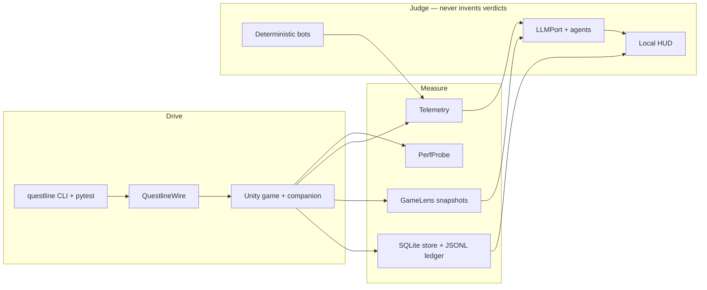
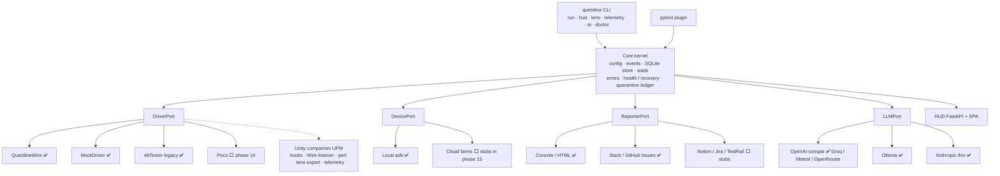
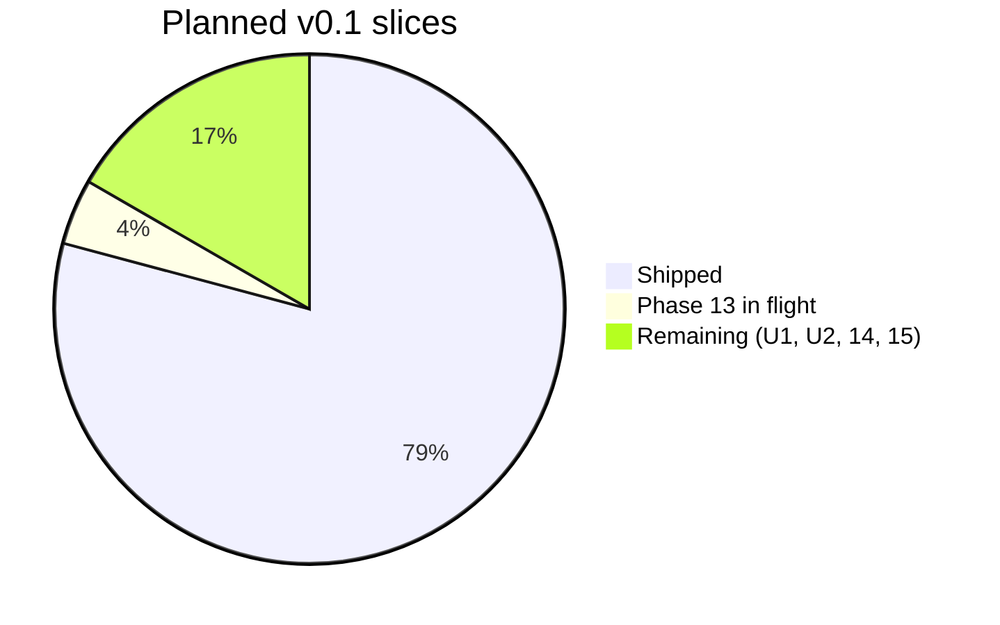
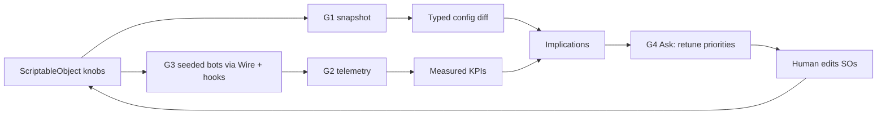

# Questline — Project briefing

**Audience:** people who do not live in this repo — collaborators, studios, investors, or
anyone asking “what is this, what works today, and why should I care?”
**Language:** English. Spanish twin: [`PROJECT-BRIEFING.es.md`](PROJECT-BRIEFING.es.md).
**Date:** 2026-09-21.
**Living operational board (maintainer):** [`STATUS-DUAL.md`](STATUS-DUAL.md).
**This document:** a snapshot for presentation. It does not replace phase briefs.

---

## 1. One-page pitch

**Questline** is an open-source, **AI-native test automation framework for games**,
Unity-first. It is Python + pytest, MIT-licensed, and validated against a real in-progress
Unity game (a tower-defense + creature-raising prototype). The package is `questline`
(Python 3.11+). Version on disk is **0.1.0**, not yet a public v0.1.0 release.

Most game-automation tools stop at “tap this button.” Most AI testing tools stop at web
DOM. Questline is built as one stack that a solo studio can actually run:

1. **Drive the game** through a cheap, local protocol (QuestlineWire) instead of a paid
   desktop broker.
2. **Measure** performance, gameplay telemetry, and balance config diffs.
3. **Exercise** balance with deterministic bots (same seed → same decisions).
4. **Explain** with AI — labeled *model reasoning*, never mixed with measured numbers.
5. **Maintain tests** with gated agents (triage, diagnose, heal, generate) whose “it
   passes” claim is **never** the verdict. The runner re-runs and parses.

The non-negotiable design rule: **AI never invents green or red.** Artifacts own numbers.
That is the product, not a slogan.

---

## 2. What it is, and what it is not

| It is | It is not |
|-------|-----------|
| A **framework** (library + pytest plugin + CLI + HUD) | A hosted SaaS or multi-user cloud |
| **Genre-agnostic** core (no reference-game type names in `src/questline`) | A finished Unreal / Godot product |
| Unity-first, **Editor + Android** live | iOS on device (port is ready; hardware is not) |
| Local-first (`questline hud` in the browser) | A replacement for Unity Editor or for designers writing ScriptableObjects |
| AI that **proposes** (retune priorities, locator diffs, test drafts) | An agent that ships or marks a build “good” |

**Happy-path live driver:** `driver = "questline"` (QuestlineWire — TCP + NDJSON).
**CI / unit:** `mock`. **Legacy remote UI:** AltTester (Desktop is *not* the €0 path).
**Second UI backend:** Poco — designed, **not shipped** (phase 14).

---

## 3. Architecture (how the pieces fit)

Everything meaningful is a **port** (interface) with swappable adapters. Switching driver,
device, reporter, or LLM is a profile change in `questline.toml`, not a rewrite.

**Authoring model:** pages + locators (`locators.yaml` → generated typed accessors) +
explicit **probe vs deadline** waits + a **quarantine ledger** (enter/leave are tooled
events, not commented-out tests).

**Truth model:** every run appends events incrementally. A killed process keeps everything
before the crash. Failures are classified `infra | test | authoring | unknown`. Mislabeling
an adb blip as a red game test is treated as the #1 trust killer in this domain.

---

## 4. What is already built

Snapshot of [`STATUS-DUAL.md`](STATUS-DUAL.md) on **2026-09-21**. “Shipped” means merged
(or, for phase 13, implemented in the current PR and dogfooded in HUD).

### 4.1 Framework phases (questline)

| Area | Status | What you can actually do |
|------|--------|---------------------------|
| Bootstrap, kernel, driver port, authoring | ✅ | pytest suites, profiles, MockDriver CI, locators, steps, quarantine |
| QuestlineWire MVP + v2 UI | ✅ | Editor + Android: hooks, find, hierarchy, tap, screenshot |
| Resilience | ✅ | Health, recovery ladder, watchdog, infra-vs-test verdicts |
| Reporters | ✅ | Console, HTML, Slack, GitHub Issues (allow-listed fields) |
| HUD I + II | ✅ | Run history, live events, launch, quarantine, profiles, perf graphs |
| PerfProbe | ✅ | FPS / mem / CPU / battery-style series, threshold asserts, HUD compare |
| GameLens G1 | ✅ | Balance snapshot + typed diff + AI implications report (measured vs reasoning) |
| Telemetry G2 | ✅ | Thin event ingest, session summaries, CLI `telemetry` |
| Deterministic bots G3 | ✅ | Live Editor matrix **75/75 passed** (~1h48). All cells **lose** — that is measured difficulty, not a bot bug |
| AI foundation (11) | ✅ | LLMPort, budgets, cost ledger, Groq + Ollama live; Mistral smoke deferred |
| Balance agent + HUD (G4) | ✅ | Browse snapshots/diffs/sessions; Ask proposes **retune priorities**, never writes SOs |
| Test agents (12) | ✅ | Triage, maintainer (diagnose/fix + gate), locator healer |
| Generation + eval (13) | 🔧 this PR | Spec → pytest with collect/execute gate; unit-gen patch; golden eval harness; HUD **Generate** + **Eval** |
| Unity CLI sidecar (U1/U2) | ⬜ catalog | After 12; does **not** replace Wire |
| Poco + Unity Test Framework (14) | ⬜ | Second UI adapter + C# results in the same store |
| Integrations & release (15) | ⬜ | CIPort, farm stubs, docs site, tagged **v0.1.0** |
| Wire play gestures (09c) | ⬜ parked | Swipe/drag only if bots cannot finish combat without them. Current gate = hooks sufficient |

**Progress toward planned v0.1 work** (19 shipped / 1 in flight / 4 remaining; 09c parked
and not counted):

### 4.2 Reference game (ElJuegaso P1) — dogfood, not the product

The framework is proven against a private Unity prototype. Game-specific names stay in the
game repo. The contract is [`GAME-INTEGRATION.md`](GAME-INTEGRATION.md).

| Game work | Status |
|-----------|--------|
| Proto D through D11 (code) | ✅ — D11 **feel playtest** still open |
| Companion + Wire Editor/Android | ✅ |
| Perf counters, SO manifest, telemetry, combat hooks | ✅ QL-3, QL-5, QL-6, QL-7 |
| Bot suite in `automation/bots` | ✅ consumed by G3 |
| Infinite mode (D12), FTUE (D13+) | ⬜ |
| Poco + UTF (QL-4), Unity CLI + Pipeline (QL-8) | ⬜ |

### 4.3 HUD — what a visitor sees

Local control center (`questline hud`, default `http://127.0.0.1:8741/`). Pages:

| Page | Job |
|------|-----|
| Runs / Live | History, death-point, artifacts; streaming events |
| Launch | Start/stop pytest against Editor, Android, or mock |
| Quarantine / Profiles | Ledger + `questline.toml` (secrets never in the file) |
| Perf | Overlay FPS/memory across runs |
| GameLens | Snapshots, diffs, telemetry sessions, Ask |
| Generate | Natural-language spec → pytest + collect gate + optional live launch |
| Eval | Agent scores: diagnosis accuracy, false-green rate, cost |
| Trends | Pass rate and flaky tests over time |

AI text in the UI is labeled **model reasoning**. Numbers come from the store.

### 4.4 The balance loop (the original module)

This is the piece that does not exist as one product in AltTester, Airtest, or web AI QA.

Live G3 result that outsiders should hear clearly: **75 runs, all lose**. The framework
did its job. The game is still too hard (or bots too weak) on the measured policies.
Retune is a **game** decision; Questline will show the delta after the next snapshot.

Known measurement gaps (honest): `config_snapshot_id=snap-unset` on that matrix (join to
G1 is incomplete unless `QUESTLINE_SNAPSHOT_ID` is set); reserved KPIs such as
`combat.damage` are catalogued, not populated until later game events (D12).

---

## 5. How AI is gated (why this is not a demo)

| Agent | Input | Output | Gate |
|-------|--------|--------|------|
| GameLens Ask | Snapshot + diff + telemetry summary | Retune **priorities** | Never green/red; never writes SOs; missing KPIs stay **gaps** |
| Triage | Finished run | Failure clusters, infra vs test vs game | Read-only |
| Maintainer | Failing test + artifacts | Diagnosis or patch | **Re-run parses pytest** — model “passed” is ignored |
| Healer | `ElementNotFound` + hierarchy | Suggested `locators.yaml` diff | Human approves |
| Generator | Markdown spec | New `test_gen_*.py` | File must **collect** (and execute where claimed); never overwrites an existing suite file |
| Eval harness | Golden broken tests (MockDriver) | Accuracy, false-green, cost, iterations | Sabotage golden must flag false-green |

Cost: every LLM attempt (including HTTP 429) is a row in `ai_calls`. Budgets are hard
stops. Providers are swappable because free tiers churn.

---

## 6. What is left

### 6.1 To a honest v0.1.0 (next on the numbered track)

| Order | Work | Why it matters to outsiders |
|------:|------|-----------------------------|
| Now | Finish / merge **phase 13** | “We have agents **and** we can score them.” Strongest portfolio artifact. |
| Parallel (game) | D11 feel playtest; optional snapshot id on bots; optional **QL-8** Unity CLI | Makes GameLens numbers join to a config version; Editor lifecycle less manual |
| Next framework | **FP-U1** Unity CLI sidecar (ensure Editor + HUD chip) | Removes “is Unity in Play?” as a tribal ritual |
| Then | **Phase 14** Poco + UTF ingest | Proves driver swap is real; C# unit results land in the same HUD |
| Then | **Phase 15** CIPort, farm stubs, docs site, PyPI tag | Installable product, not only a clone |

**Do not start** 09c or phase 14 from a random slice. Order is documented on purpose.

### 6.2 After v0.1 — high-value catalog (not scheduled)

From [`03-FUTURE-PHASES.md`](03-FUTURE-PHASES.md) and [`FEATURE-PIPELINE-PLAN.md`](FEATURE-PIPELINE-PLAN.md):

| Theme | Examples | Why it would help |
|-------|----------|-------------------|
| Platform | iOS simulator CI, Appium OS dialogs, Tauri HUD installers | Reach and “it feels like a product” |
| Test types | Save/load matrix, visual regression, monkey/soak, localization, IAP mocks, API/OpenAPI | Full game-dev lifecycle, not only combat smoke |
| Autonomy | `questline mcp`, nightly triage pipeline, healer auto-PR **after** eval thresholds | Agents that work while you sleep — only if eval says they earned it |
| Feature pipeline | git-diff scan → coverage plan → generate unit/e2e/balance-watch | “Every feature ships with tests” as a loop, not a hope |
| Balance+ | Richer telemetry names, AI bot **policies** vs deterministic baselines, parameter search | From “bots lose” to “search the knobs” |

### 6.3 Small but real debt (backlog)

- Unity `.meta` files missing → git UPM import of the companion is awkward (games copy/embed).
- `mypy` is not a CI gate yet.
- Probe-budget `wait_for` path is incomplete vs the architecture doc.
- No HUD command palette; no in-repo sample APK.
- Notion/Jira/TestRail and device-farm adapters are stubs or empty extras.
- **INC-0010** (watchdog thread `pytest.exit` during the live matrix) is still **open**.
- Mistral live smoke still deferred (Groq + Ollama verified).

---

## 7. Weaknesses (internal review, said plainly)

These are the questions a skeptical engineer or producer should ask. Answers are current,
not aspirational.

### Product and proof

1. **One dogfood game, one maintainer, Windows-first.** Genre-agnostic is a coding rule,
   not a multi-studio proof. Unreal/Godot/iOS are not products.
2. **“Easy to switch drivers” is architecturally true, empirically thin.** Live happy path
   is Wire. Poco is empty extra. AltTester is legacy. Until phase 14, the conformance suite
   is the claim’s strongest evidence, not a second live UI stack.
3. **v0.1.0 is not released.** No docs site, no PyPI workflow in the phase-15 sense, README
   is a maintainer quickstart. Hard to evaluate without cloning.
4. **HUD is local-only.** Fine for a solo studio; a QA lead used to BrowserStack dashboards
   will not see users, scheduling, or RBAC.
5. **Generate/eval are young.** Four incidents (INC-0011–0014) landed on 2026-09-21 around
   silent MockDriver fallback, wrong output file, Groq 429, and a bad fixture import. The
   gates exist because this class of bug is exactly what ships in AI demos.

### Balance and bots

6. **G3 shows the loop works; it does not yet show a retuned game.** All-lose is valuable
   data. Without `QUESTLINE_SNAPSHOT_ID` and D11 feel work, the “cause → effect” story is
   incomplete.
7. **Telemetry is thin by design.** Damage, projectiles, ranch growth are reserved names.
   AI must not invent them. That honesty is a strength *and* a gap versus analytics suites.
8. **No parameter search / cloud grid.** Unity Game Simulation–style “1,700 minutes in 30”
   is not here. N=3 × 5 policies is a studio-scale matrix, not a Monte Carlo economy.
9. **Bots are hook-centric.** That is the right call for determinism, but “plays like a
   human” (drag-deploy, gestures) is parked. Image-only / vision-only play is not the path.

### AI

10. **Eval goldens use MockDriver, not live Unity failures.** That is correct for CI; it
    under-claims “agents work on my shipped game.” Live maintainer eval is still a human
    checklist.
11. **LLM cost and rate limits are operational risk.** Groq 429 already broke Generate UX
    once. Free-tier maps churn (Llama 3.3 70B shutdown is in the AI roadmap). Abstraction
    is survival; reliability is not free.
12. **Healer is suggest-only.** Good. Competitors ship silent runtime heals that hide
    product bugs. Questline must not copy that blindly.
13. **No MCP server yet.** Cursor/`unity mcp` is a different object (Editor). Outsiders
    who live in agentic IDEs will ask for `questline mcp` (catalog FP-A1).

### Engineering

14. **Companion packaging.** Missing `.meta` files block clean UPM git install.
15. **Editor lifecycle is still tribal knowledge** until U1 (`ensure-editor`).
16. **Watchdog INC-0010** is an accepted-looking warning on a green matrix — the kind of
    issue that bites overnight CI later.
17. **Docs are excellent for agents, heavy for humans.** STATUS-DUAL is Spanish and dense.
    This briefing exists because the repo does not yet have an outsider landing page
    (that is phase 15).
18. **Security model matches local-first.** Allow-lists on exporters are real. There is no
    multi-tenant threat model because there is no multi-tenant product.

None of these are secret. Several are already in [`BACKLOG.md`](phases/BACKLOG.md) and
[`INCIDENTS.md`](INCIDENTS.md) (14 incidents filed; 13 fixed, 1 open).

---

## 8. Comparable tools — and what to steal

Questline does not compete with one product. It sits on three maps at once: **game UI
drivers**, **perf / device**, and **AI quality**. The interesting move is to stay small
and steal *mechanisms*, not to clone SaaS.

### 8.1 Game UI and engine automation

| Tool | What it is | Where Questline already differs | Steal / incorporate |
|------|------------|--------------------------------|---------------------|
| **AltTester** | Unity instrumentation, rich object API, commercial Desktop | Wire is the €0 happy path; AltTester kept as legacy adapter | Component property get/set; richer input (swipe, multi-touch) when 09c unparks; do **not** revive Desktop as default |
| **Airtest + Poco** (NetEase) | Python, hierarchy + **image/OCR**, IDE, Unity/Cocos/native | Phase 14 *is* Poco as second backend; no IDE recorder yet | **Hierarchy viewer** for locator authoring; image fallback for uninstrumented popups; drag APIs; Airtest-style HTML evidence |
| **GameDriver** | Paid Unity/Unreal, engine-state asserts | Open-source, hooks-first, GameLens on top | Unreal adapter **later**; first-class **gameplay state** asserts (Questline already prefers hooks over pixels — lean into that in docs) |
| **Unity Test Framework** | In-engine Edit/Play Mode C# | Ingest planned in phase 14 | Pipeline `run_tests` via U1; one HUD for Python + C# |
| **Unreal Gauntlet / UAT** | Packaged-build E2E at studio scale | Out of scope | Pattern only: “packaged session + logs + soak” as a future device-farm story |
| **AWS Bedrock QA agent** (2026 blog) | NL test cases → AltTester loop on Device Farm; ~$0.20/test | Questline already has hierarchy, tools, HUD traces, **and** forbids the model from calling `verify(passed)` as truth | **Perceive–reason–act–reflect** for a *player* agent (post G3); **knowledge base** of game docs; discovery pass that catalogs interactables; spatial helpers (`toward` / `away_from`). Keep Questline’s verdict rule — the AWS demo’s `verify()` tool is the anti-pattern we refuse |

### 8.2 Performance, farms, CI

| Tool | Steal / incorporate |
|------|---------------------|
| **GameBench / PerfDog / UWA** | One-click device HUD: GPU, thermal, network, battery drain. PerfProbe is the seed; soak trend + anomaly (catalog) is the gap |
| **BrowserStack / BitBar / Firebase Test Lab / AWS Device Farm** | Phase 15 stubs → one validated trial. Device Farm + Wire is how the AWS agent ran on hardware |
| **game-ci** | Documented Unity license + batchmode recipes; pairs with phase 15 and U1 `unity install` |

### 8.3 Balance and design intelligence (GameLens’s true peers)

| Tool | Steal / incorporate |
|------|---------------------|
| **Unity Game Simulation** (preview / cloud grid) | Headless bot + **counters** + dashboard aggregates + parameter grid. Questline has bots + telemetry + HUD; missing **search** (thousands of combos) and headless scale |
| **Machinations** | Visual economy graph; **Bayesian optimizer** on knobs. Do not become a diagram tool — optionally **export** G1 snapshots into a design graph, or add a constrained “propose numeric ranges” mode that still never writes SOs |
| **Unity ML-Agents** | Later **learned policies** compared to G3 deterministic baselines — already sketched as “AI bot policies,” not a replacement for seeded scripts |
| **PlayFab / Unity Analytics / GameAnalytics** | Live-ops event schemas. Keep Questline **pre-live** and local; add analytics **contract tests** (FP-T1) so the game cannot ship a renamed event |

**Positioning line:** Machinations simulates the *model*. Game Simulation brute-forces the
*build*. Questline **measures the real Editor/device build**, diffs the **actual SOs**, and
lets a human (with optional AI narration) retune. That is the honest wedge for indies who
will not buy a cloud sim grid.

### 8.4 AI testing (mostly web — translate carefully)

| Tool | Mechanism | Questline translation |
|------|-----------|------------------------|
| **Testim Smart Locators / mabl auto-heal** | Many attributes per element; runtime pick | Multi-signal locator records in `locators.yaml` (id + path + text + neighbor), scored at heal time — still **human approve** |
| **Katalon Self-Healing Insights** | Temporary heal + screenshot + explicit accept | HUD healer panel: before / after / screenshot / accept. Closest cultural fit |
| **KaneAI Adaptive Heal** | Re-author from original **natural-language intent** | Store the spec sentence with each generated step (phase 13 already starts from spec). Heal from intent + hierarchy, not only xpath-ish strings |
| **Healenium** | Wrap WebDriver, swap locator at runtime | Optional `SelfHealingHandle` behind a flag — **off by default** so product bugs stay red |
| **Applitools Eyes** | Visual AI | FP-T3: SSIM + masks + LLM “intentional vs bug” **suggestion** |
| **Playwright Trace Viewer / codegen** | Time-travel + recorder | HUD “replay this test’s screenshots + steps”; optional recorder later — not v0.1 |
| **Midscene / AskUI** | Screenshot + NL, weak instrumentation | Fallback when Wire hooks are missing (OS dialogs, WebViews) — pair with Appium (FP-P4), do not replace hooks |
| **Langfuse / DeepEval** | Prompt traces, eval dashboards | Phase 13 exporters (stub OK). HUD Eval is the native view |
| **testRigor / Autify** | Plain-English SaaS tests | We generate **code you can review**. Do not become a recorder lock-in |

### 8.5 Recommended “steal list” (priority)

If the next six months of Questline borrow from the market, this is the short list:

1. **Katalon-style heal review in HUD** — screenshot, old locator, new locator, accept.
2. **Multi-attribute locators** — Testim, adapted to Unity names/paths/components.
3. **Poco + hierarchy inspector** (phase 14 + a small viewer) — Airtest’s onboarding win.
4. **Intent stored with generated steps** — KaneAI, without silent rewrite.
5. **Perceive–act–reflect player agent** on top of Wire tools — AWS/TITAN, **without**
   letting the model own pass/fail.
6. **Counter + grid-search loop** on G3 — Unity Game Simulation’s insight, run locally
   first (N=50 on Editor) before any cloud.
7. **`questline mcp`** — the distribution channel for agents that already sit in Cursor.
8. **Docs site + 10-minute MockDriver quickstart** — phase 15; this briefing is a stopgap.

Explicit **do not steal:** silent auto-green heals; LLM-as-oracle; Desktop license as the
happy path; mixing predicted KPIs with measured ones.

---

## 9. How to show this in 15 minutes

1. Open HUD (real store or smoke fixture — say which). Walk **Runs → Live → Launch**.
2. **GameLens:** a snapshot diff + Ask. Point at the “model reasoning / measured / gap”
   labels.
3. **Generate:** a five-line spec → file that **collects**. Mention the gate, not the magic.
4. **Eval:** two configs, false-green column. This is the trust slide.
5. Optional live: Unity Play + Wire smoke, or the G3 sentence: *75/75 executed, 75 lose,
   numbers not opinions.*

Operator clicks: [`hud-user-guide.md`](hud-user-guide.md).
Install/dev: [`README.md`](../README.md).

---

## 10. Sources for this briefing

Internal: `STATUS-DUAL.md`, `00-MASTER-PLAN.md`, `01-ARCHITECTURE.md`, `02-AI-ROADMAP.md`,
`03-FUTURE-PHASES.md`, `BALANCE-AUTOMATION.md`, `GAME-INTEGRATION.md`, `BACKLOG.md`,
`INCIDENTS.md`, phase briefs 13–15, and the `src/questline` module map.

External (public pages, 2026): AltTester docs; Airtest/Poco; GameDriver round-ups; Unity
Game Simulation package docs; Machinations Unity plugin / AI Balancer; AWS *Building an
AI game testing agent with Amazon Bedrock* (AltTester + Device Farm + ReAct loop);
Testim / mabl / KaneAI / Katalon self-heal write-ups. Vendor accuracy numbers are
**marketing**, not reproduced here.

---

*Questline is MIT. The reference game is private. This briefing describes the framework
repository at `D:\dev\questline` as of 2026-09-21 and is safe to share without secrets,
home paths, or API keys.*
