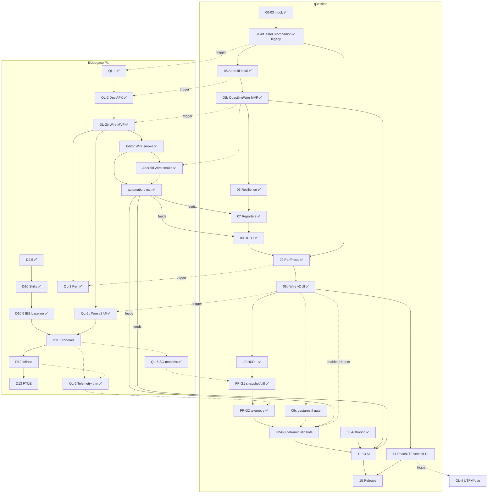

# Dual status — Questline ↔ ElJuegaso (P1)

> **Vista de una pasada** del estado y el orden de trabajo de ambos proyectos.
> **Canónico en este repo** (`questline`). El juego enlaza aquí desde
> `docs/STATUS-DUAL.md` (puntero).  
> **Actualizar en cada fase/PR** que cambie estado (ver §5).  
> Última revisión: **2026-08-13** (fw **FP-G2** ✅ ADR-0010; game **QL-6** thin emit ✅ dogfood Editor; QL-5/FP-G1 ✅; next **FP-G3** bots → **11** AI — see [`BALANCE-AUTOMATION.md`](BALANCE-AUTOMATION.md)).

---

## 1. Semáforo (ahora)

| Proyecto | Dónde vamos | Hecho reciente | Siguiente | Bloqueo |
|----------|-------------|----------------|-----------|---------|
| **questline** | v0.1 + **05b–10** + **FP-G1** + **FP-G2** | Thin telemetry ingest + companion API ✅ (ADR-0010) | **FP-G3** bots; **11** AI después de bots | AltTester Desktop fuera del happy path; G2 HUD diferido |
| **ElJuegaso P1** | Proto D (feel) | **QL-1…3 + QL-5 + QL-6** + Wire + **`automation/`** + **D10.5** + **D11 código** | Playtest D11; luego bots FP-G3 | Poco = 2º UI (fw 14); Drag-deploy → bots usan Tap/hooks (09c solo si gate); IEB-1…5 aún no son SO (hueco GameLens) |


**Drivers (prioridad):**

| Rol | Driver | Notas |
|-----|--------|-------|
| **Happy path live** | `questline` (QuestlineWire) | Hooks ✅; **UI find/tap ✅** (09b / ADR-0008) |
| **2º UI backend** | **Poco** (phase-14) | Prueba “switch drivers”; rico / no-Unity |
| **Legacy remoto** | `alttester` | Solo si hace falta; Desktop — **no** €0 happy path |
| CI / unit | `mock` | Siempre |

**Repos locales canónicos**

| Repo | Path |
|------|------|
| questline | `D:\dev\questline` |
| ElJuegaso | `D:\Projects\ElJuegaso` (**no** `C:\Users\Pablo\Projects\ElJuegaso`) |

---

## 2. Roadmap questline (fases framework)

| # | Fase | Estado | Notas |
|---|------|--------|-------|
| 0 | Bootstrap | ✅ | |
| 1 | Core kernel | ✅ | |
| 2 | Driver abstraction | ✅ | |
| 3 | Authoring layer | ✅ | |
| 4 | AltTester + companion | ✅ | Histórico; live Desktop **abandonado**; adapter **legacy remoto** |
| 5 | Android local | ✅ código/CI | Device plumbing; live = Wire |
| **05b** | **QuestlineWire** MVP | ✅ | Hooks/session; Editor + Android live |
| 6 | Resilience | ✅ | Health/recovery/watchdog; ADR-0006 |
| 7 | Reporters | ✅ | console/HTML/Slack/GH Issues |
| 8 | HUD I viewer | ✅ | FastAPI + SPA; ADR-0007 |
| 9 | PerfProbe | ✅ | Sampler + android + companion + asserts + CLI; HUD graphs ✅ in **10** |
| **09b** | **Wire v2 UI** | ✅ | find/hierarchy/tap/screenshot; ADR-0008; trigger **QL-2c** |
| 10 | HUD II control | ✅ | Launcher, quarantine, profiles, perf graphs; dogfood INC-0003…0006 |
| **FP-G1** | GameLens snapshot/diff | ✅ | ADR-0009; CLI `lens`; AI report → tras **11** — [`gamelens.md`](gamelens.md) · [`phase-fp-g1`](phases/phase-fp-g1-gamelens-snapshot.md) |
| **FP-G2** | Telemetría thin | ✅ | ADR-0010; CLI `telemetry`; HUD diferido — [`telemetry.md`](telemetry.md) · [`phase-fp-g2`](phases/phase-fp-g2-telemetry.md); trigger **QL-6** |
| **FP-G3** | Bots deterministas | ⬜ **next (fw)** | Curvas medidas; brief [`phase-fp-g3`](phases/phase-fp-g3-bots.md); AI policies tras **11**. Game emit: ElJuegaso `integracion-questline.md` §10 |
| 11 | AI foundation | ⬜ **tras bots** | LLMPort; consume datos G2/G3; desbloquea informe G1 |
| 12 | AI agents | ⬜ | |
| 13 | AI generation + eval | ⬜ | |
| 14 | **Poco** + UTF | ⬜ | 2º UI backend + UTF; trigger **QL-4** |
| 15 | Integrations & release | ⬜ | v0.1.0 |

**Wire follow-ups (no renumeran 06–15):**

| Ítem | Estado |
|------|--------|
| Wire MVP hooks (`hello`/`ping`/`app_state`/`hooks_manifest`/`call_hook`) | ✅ |
| Editor live smoke | ✅ |
| Android live smoke (Dev APK con Wire) | ✅ 2026-08-09 |
| Wire v2 find/hierarchy/tap | ✅ **09b** (ADR-0008) — sync game **QL-2c** |
| Wire play gestures (swipe/drag) | ⬜ **09c** — solo si gate FP-G3 ([`phase-09c`](phases/phase-09c-wire-play-gestures.md)) |

Detalle: [`00-MASTER-PLAN.md`](00-MASTER-PLAN.md) §5 · [`BALANCE-AUTOMATION.md`](BALANCE-AUTOMATION.md) · [`wire-setup.md`](wire-setup.md) ·
[`ADR-0005`](adr/ADR-0005-questline-wire.md) · [`ADR-0008`](adr/ADR-0008-wire-v2-ui.md) ·
[`phase-09b`](phases/phase-09b-wire-v2.md) · [`performance.md`](performance.md) ·
[`resilience.md`](resilience.md) ·
[`ADR-0006`](adr/ADR-0006-recovery-ladder.md) · [`reporting.md`](reporting.md) ·
[`hud.md`](hud.md) · [`ADR-0007`](adr/ADR-0007-hud-frontend-stack.md).

---

## 3. Roadmap ElJuegaso P1 (proto D + QL-n)

| Id | Qué | Estado | Docs |
|----|-----|--------|------|
| D1–D9.5 | Tablero → hub/designer | ✅ (código; playtests varios) | [`plan-fase-d.md`](https://github.com/Knutronko/ElJuegaso/blob/main/docs/prototipos/P1/plan-fase-d.md) |
| D10 | Skills / balance / loadout | ✅ código; feel vía D10.5 | `diseno-crecimiento-roster.md` |
| **D10.5** | Balance **IEB** (entry infinito) | ✅ baseline (código+Pass A/B; Hecho=playtest) | `diseno-d10-5-balance-ieb.md` |
| D11 | Economía mid/late + GameLens KPIs | ✅ código (Hecho=playtest) | `economias.md` + diseno-d10-5 § Calibración |
| D12 | Modo infinito | ⬜ | `diseno-modo-infinito.md` |
| D13+ | FTUE, visual, save debt… | ⬜ | [`roadmap-post-d6.md`](https://github.com/Knutronko/ElJuegaso/blob/main/docs/prototipos/P1/roadmap-post-d6.md) |
| **QL-1** | Companion + hooks + smoke GOs | ✅ | `integracion-questline.md` |
| **QL-2** | APK DEV `QUESTLINE_DEV` | ✅ | Dev APK con Wire en device |
| **QL-2b** | Bootstrap Wire + companion | ✅ | Editor + Android Wire **verde** |
| **QL-2c** | Companion Wire v2 UI ops | ✅ companion (ElJuegaso PR #41) | Rebuild Dev APK for Android UI optional |
| **QL-3** | Perf counters companion | ✅ | `QuestlinePerfProvider` + Dev APK; Editor + Android maintainer 2026-08-11 |
| **QL-4** | UTF C# + Poco (2º UI) | ⬜ | Trigger fw **14** |
| **QL-5** | Manifest SOs (GameLens) | ✅ | `balance_manifest.json` ADR-0009; companion `QuestlineBalanceExport`; IEB-1…5 no son assets |
| **QL-6** | Telemetría | ✅ | `P1QuestlineTelemetry` → ADR-0010; Editor spool importado 2026-08-13. Labels reales + gaps: game `integracion-questline.md` §10.4 · **antes de bots** |
| exit | Scaffold `automation/` | ✅ coverage-demo | Hooks ✅; UI find/tap → **QL-2c** (fw 09b ✅; Poco = 14) |

Contrato espejo: [`GAME-INTEGRATION.md`](GAME-INTEGRATION.md).

---

## 4. Dependencias mutuas + orden propuesto



### Orden de implementación sugerido (próximos pasos)

| # | Trabajo | Repo | Por qué ahora |
|---|---------|------|----------------|
| 1 | Playtest **D11** (feel B1–B5) | ElJuegaso | Código D11 + QL-6 emit listos; feel humano |
| 2 | **FP-G3** bots deterministas | ambos | Playtest automático / curvas medidas; leer game `integracion-questline.md` §10.4–10.5; brief [`phase-fp-g3`](phases/phase-fp-g3-bots.md) |
| 2b | Gate Wire playability → **09c** solo si hace falta | questline | Drag/gestures; prefer Tap+hooks |
| 3 | **phase-11** AI foundation | questline | Informe G1 + políticas AI en bots usando datos medidos |
| 4 | Rebuild Dev APK (Android Wire v2) | ElJuegaso | Opcional |
| 5 | **D12** infinito (telemetría más rica: `FUTURE_EVENT_NAMES` en [`telemetry.md`](telemetry.md)) | ElJuegaso | Tras bots baseline; no reinventar nombres |
| 6 | **phase-14 Poco + QL-4** | ambos | 2º UI backend + UTF |


**Stack live:** Wire = hooks + hierarchy/find/tap (**09b** ✅). **Poco** = 2º adapter.
**AltTester** = legacy remoto. Prompts QL-6/G3: [`SESSION-PROMPTS-QL6-FPG3.md`](phases/SESSION-PROMPTS-QL6-FPG3.md).

---

## 5. Cómo actualizar este documento (obligatorio)

### Quién

Toda sesión IA / PR de **fase questline (0–15 / 05b / 09b / FP)** o **fase D / sesión QL-n**
del juego que cambie estado.

### Qué tocar

1. **Este archivo** (`questline/docs/STATUS-DUAL.md`): semáforo §1 + filas de roadmap §2/§3 + fecha “Última revisión”.
2. Si cambia una dependencia u orden: ajustar Mermaid / tabla §4.
3. ElJuegaso: el puntero `docs/STATUS-DUAL.md` solo se edita si cambia la URL/path canónico (raro).

### Checklist PR (copiar)

```
STATUS-DUAL: actualizar semáforo / filas afectadas + fecha (questline/docs/STATUS-DUAL.md)
```

Formalizado en: questline `GAME-INTEGRATION.md` + `00-MASTER-PLAN.md` §6 · ElJuegaso `AGENTS.md` + rules + checklist P1.

---

## 6. Enlaces rápidos

| Recurso | Link |
|---------|------|
| Questline master plan | [`00-MASTER-PLAN.md`](00-MASTER-PLAN.md) |
| Game integration contract | [`GAME-INTEGRATION.md`](GAME-INTEGRATION.md) |
| QuestlineWire setup (happy path) | [`wire-setup.md`](wire-setup.md) |
| QuestlineWire ADR (MVP) | [`ADR-0005`](adr/ADR-0005-questline-wire.md) |
| Wire v2 UI ADR | [`ADR-0008`](adr/ADR-0008-wire-v2-ui.md) · [`phase-09b`](phases/phase-09b-wire-v2.md) |
| PerfProbe | [`performance.md`](performance.md) · [`phase-09`](phases/phase-09-perfprobe.md) |
| Resilience | [`resilience.md`](resilience.md) · [`ADR-0006`](adr/ADR-0006-recovery-ladder.md) |
| Reporting | [`reporting.md`](reporting.md) |
| HUD control center | [`hud.md`](hud.md) · [`ADR-0007`](adr/ADR-0007-hud-frontend-stack.md) · [`phase-10`](phases/phase-10-hud-control-center.md) |
| Balance automation / GameLens loop | [`BALANCE-AUTOMATION.md`](BALANCE-AUTOMATION.md) |
| GameLens (FP-G1) | [`gamelens.md`](gamelens.md) · [`ADR-0009`](adr/ADR-0009-gamelens-snapshot.md) · [`phase-fp-g1`](phases/phase-fp-g1-gamelens-snapshot.md) |
| Telemetry (FP-G2) | [`telemetry.md`](telemetry.md) · [`ADR-0010`](adr/ADR-0010-gamelens-telemetry.md) · [`phase-fp-g2`](phases/phase-fp-g2-telemetry.md) |
| Phase 05b brief | [`phase-05b-questline-wire.md`](phases/phase-05b-questline-wire.md) |
| Android / adb | [`android.md`](android.md) |
| Legacy AltTester setup | [`unity-setup.md`](unity-setup.md) |
| P1 integración QL | [integracion-questline.md](https://github.com/Knutronko/ElJuegaso/blob/main/docs/prototipos/P1/integracion-questline.md) |
| P1 roadmap post-D6 | [roadmap-post-d6.md](https://github.com/Knutronko/ElJuegaso/blob/main/docs/prototipos/P1/roadmap-post-d6.md) |
| P1 plan D | [plan-fase-d.md](https://github.com/Knutronko/ElJuegaso/blob/main/docs/prototipos/P1/plan-fase-d.md) |
