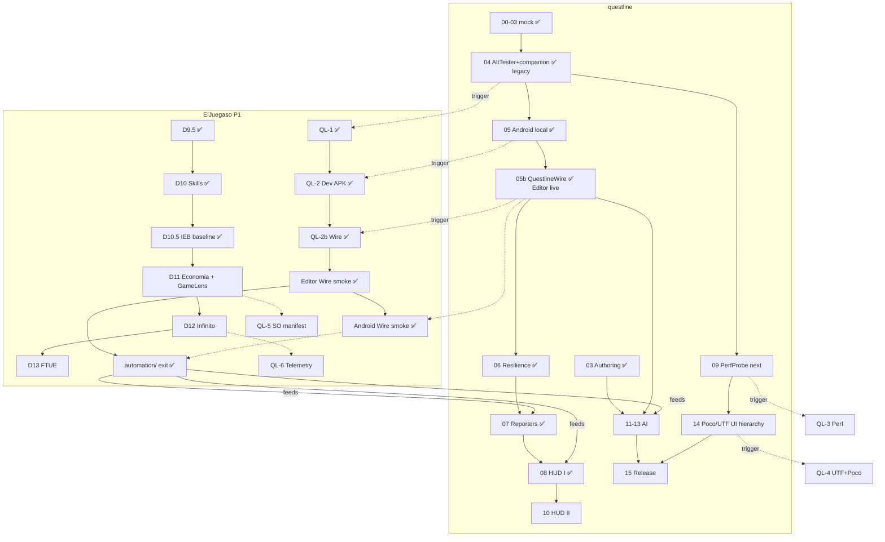

# Dual status — Questline ↔ ElJuegaso (P1)

> **Vista de una pasada** del estado y el orden de trabajo de ambos proyectos.
> **Canónico en este repo** (`questline`). El juego enlaza aquí desde
> `docs/STATUS-DUAL.md` (puntero).  
> **Actualizar en cada fase/PR** que cambie estado (ver §5).  
> Última revisión: **2026-08-11** (phase-08 HUD I viewer ✅ → next **09** PerfProbe).

---

## 1. Semáforo (ahora)

| Proyecto | Dónde vamos | Hecho reciente | Siguiente | Bloqueo |
|----------|-------------|----------------|-----------|---------|
| **questline** | v0.1 fases 0–15 + **05b Wire** + **06–08** | Editor + Android Wire; Reporters; **HUD I viewer** (`questline hud`) | **09** PerfProbe | Ninguno crítico; AltTester Desktop **fuera** del happy path |
| **ElJuegaso P1** | Proto D (feel) | **QL-1/2/2b** + Wire + **`automation/`** + **D10.5 IEB baseline** (PR #40) | **D11** economía mid/late + GameLens KPIs · (fw 09↔QL-3) | AltTester UPM **remoto/legacy**; Poco = UI (fw 14 / QL-4) |

**Drivers (prioridad):**

| Rol | Driver | Notas |
|-----|--------|-------|
| **Happy path live** | `questline` (QuestlineWire) | Hooks-first; Editor ✅ · Android ✅ (`adb forward`) |
| **UI hierarchy / find / tap** | **Poco** (phase-14) | Preferido frente a AltTester para UI completa |
| **Legacy remoto** | `alttester` | Solo si hace falta; requiere Desktop — **no** €0 happy path |
| CI / unit | `mock` | Siempre |

**Repos locales canónicos**

| Repo | Path |
|------|------|
| questline | `D:\dev\questline` |
| ElJuegaso | `D:\Projects\ElJuegaso` (**no** `C:\Users\Pablo\Projects\ElJuegaso`) |

---

## 2. Roadmap questline (fases framework)

| # | Fase | Estado | Notas |
|---|------|--------|-------|
| 0 | Bootstrap | ✅ | |
| 1 | Core kernel | ✅ | |
| 2 | Driver abstraction | ✅ | |
| 3 | Authoring layer | ✅ | |
| 4 | AltTester + companion | ✅ | Histórico; live Desktop **abandonado**; adapter **legacy remoto** |
| 5 | Android local | ✅ código/CI | Device plumbing; live = Wire |
| **05b** | **QuestlineWire** | ✅ | Editor + Android live verdes (`wire-smoke`) |
| 6 | Resilience | ✅ | Health/recovery/watchdog; `tests/resilience/`; ADR-0006 |
| 7 | Reporters | ✅ | console/HTML/Slack/GH Issues; `docs/reporting.md`; fakes in CI |
| 8 | HUD I viewer | ✅ | FastAPI + SPA embebida; `docs/hud.md`; ADR-0007 |
| 9 | PerfProbe | ⬜ **next (fw)** | Trigger juego **QL-3** |
| 10 | HUD II control | ⬜ | |
| 11 | AI foundation | ⬜ | |
| 12 | AI agents | ⬜ | |
| 13 | AI generation + eval | ⬜ | |
| 14 | **Poco** + UTF | ⬜ | **UI hierarchy primaria** (no AltTester); trigger **QL-4** |
| 15 | Integrations & release | ⬜ | v0.1.0 |

**Wire follow-ups (no renumeran 06–15):**

| Ítem | Estado |
|------|--------|
| Wire MVP hooks (`hello`/`ping`/`app_state`/`hooks_manifest`/`call_hook`) | ✅ |
| Editor live smoke | ✅ |
| Android live smoke (Dev APK con Wire) | ✅ 2026-08-09 |
| Wire v2 find/hierarchy/tap | ❌ **no planificado** — usar **Poco** (14) |

Detalle: [`00-MASTER-PLAN.md`](00-MASTER-PLAN.md) §5 · [`wire-setup.md`](wire-setup.md) ·
[`ADR-0005`](adr/ADR-0005-questline-wire.md) · [`resilience.md`](resilience.md) ·
[`ADR-0006`](adr/ADR-0006-recovery-ladder.md) · [`reporting.md`](reporting.md) ·
[`hud.md`](hud.md) · [`ADR-0007`](adr/ADR-0007-hud-frontend-stack.md).

---

## 3. Roadmap ElJuegaso P1 (proto D + QL-n)

| Id | Qué | Estado | Docs |
|----|-----|--------|------|
| D1–D9.5 | Tablero → hub/designer | ✅ (código; playtests varios) | [`plan-fase-d.md`](https://github.com/Knutronko/ElJuegaso/blob/main/docs/prototipos/P1/plan-fase-d.md) |
| D10 | Skills / balance / loadout | ✅ código; feel vía D10.5 | `diseno-crecimiento-roster.md` |
| **D10.5** | Balance **IEB** (entry infinito) | ✅ baseline (código+Pass A/B; Hecho=playtest) | `diseno-d10-5-balance-ieb.md` |
| D11 | Economía mid/late + GameLens KPIs | ⬜ **siguiente** | `economias.md` + diseno-d10-5 § Calibración |
| D12 | Modo infinito | ⬜ | `diseno-modo-infinito.md` |
| D13+ | FTUE, visual, save debt… | ⬜ | [`roadmap-post-d6.md`](https://github.com/Knutronko/ElJuegaso/blob/main/docs/prototipos/P1/roadmap-post-d6.md) |
| **QL-1** | Companion + hooks + smoke GOs | ✅ | `integracion-questline.md` |
| **QL-2** | APK DEV `QUESTLINE_DEV` | ✅ | Dev APK con Wire en device |
| **QL-2b** | Bootstrap Wire + companion | ✅ | Editor + Android Wire **verde** |
| **QL-3** | Perf counters companion | ⬜ | Trigger fw **09** |
| **QL-4** | UTF C# + Poco (UI) | ⬜ | Trigger fw **14** — Poco > AltTester |
| **QL-5** | Manifest SOs (GameLens) | ⬜ | Trigger FP-G1 · encaja **D11** |
| **QL-6** | Telemetría | ⬜ | Trigger FP-G2 · encaja **D12** |
| exit | Scaffold `automation/` | ✅ coverage-demo | Hooks-first Wire Editor verde; Android Wire fw smoke ✅; UI find/tap → Poco (QL-4) |

Contrato espejo: [`GAME-INTEGRATION.md`](GAME-INTEGRATION.md).

---

## 4. Dependencias mutuas + orden propuesto



### Orden de implementación sugerido (próximos pasos)

| # | Trabajo | Repo | Por qué ahora |
|---|---------|------|----------------|
| 1 | **phase-09 PerfProbe** | questline | Next fw phase; series → HUD II graphs |
| 2 | **D11** economía mid/late + GameLens KPIs | ElJuegaso | Siguiente proto tras D10.5; paralelo a fw 09 |
| 3 | **QL-3 / QL-5** ↔ fw 09 / FP-G1 | ambos | Perf counters + GameLens SO |
| 4 | **D12 ↔ QL-6** | ambos | Infinito + telemetría |
| 5 | **phase-14 Poco + QL-4** | ambos | **UI hierarchy** (Poco > AltTester legacy) |

**Stack live:** Wire = hooks/e2e smoke. **Poco** = find/hierarchy/tap cuando haga falta UI rica.
**AltTester** = opción remota legacy (Desktop), no primaria.

---

## 5. Cómo actualizar este documento (obligatorio)

### Quién

Toda sesión IA / PR de **fase questline (0–15 / 05b / FP)** o **fase D / sesión QL-n**
del juego que cambie estado.

### Qué tocar

1. **Este archivo** (`questline/docs/STATUS-DUAL.md`): semáforo §1 + filas de roadmap §2/§3 + fecha “Última revisión”.
2. Si cambia una dependencia u orden: ajustar Mermaid / tabla §4.
3. ElJuegaso: el puntero `docs/STATUS-DUAL.md` solo se edita si cambia la URL/path canónico (raro).

### Checklist PR (copiar)

```
STATUS-DUAL: actualizar semáforo / filas afectadas + fecha (questline/docs/STATUS-DUAL.md)
```

Formalizado en: questline `GAME-INTEGRATION.md` + `00-MASTER-PLAN.md` §6 · ElJuegaso `AGENTS.md` + rules + checklist P1.

---

## 6. Enlaces rápidos

| Recurso | Link |
|---------|------|
| Questline master plan | [`00-MASTER-PLAN.md`](00-MASTER-PLAN.md) |
| Game integration contract | [`GAME-INTEGRATION.md`](GAME-INTEGRATION.md) |
| QuestlineWire setup (happy path) | [`wire-setup.md`](wire-setup.md) |
| QuestlineWire ADR | [`ADR-0005`](adr/ADR-0005-questline-wire.md) |
| Resilience | [`resilience.md`](resilience.md) · [`ADR-0006`](adr/ADR-0006-recovery-ladder.md) |
| Reporting | [`reporting.md`](reporting.md) |
| HUD viewer | [`hud.md`](hud.md) · [`ADR-0007`](adr/ADR-0007-hud-frontend-stack.md) |
| Phase 05b brief | [`phase-05b-questline-wire.md`](phases/phase-05b-questline-wire.md) |
| Android / adb | [`android.md`](android.md) |
| Legacy AltTester setup | [`unity-setup.md`](unity-setup.md) |
| P1 integración QL | [integracion-questline.md](https://github.com/Knutronko/ElJuegaso/blob/main/docs/prototipos/P1/integracion-questline.md) |
| P1 roadmap post-D6 | [roadmap-post-d6.md](https://github.com/Knutronko/ElJuegaso/blob/main/docs/prototipos/P1/roadmap-post-d6.md) |
| P1 plan D | [plan-fase-d.md](https://github.com/Knutronko/ElJuegaso/blob/main/docs/prototipos/P1/plan-fase-d.md) |
