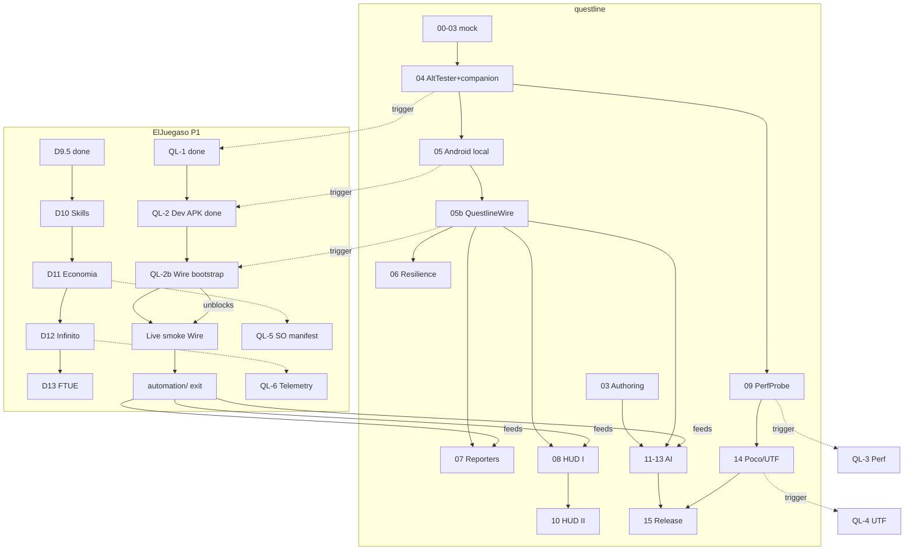

# Dual status — Questline ↔ ElJuegaso (P1)

> **Vista de una pasada** del estado y el orden de trabajo de ambos proyectos.
> **Canónico en este repo** (`questline`). El juego enlaza aquí desde
> `docs/STATUS-DUAL.md` (puntero).  
> **Actualizar en cada fase/PR** que cambie estado (ver §5).  
> Última revisión: **2026-08-08** (QuestlineWire Gate A).

---

## 1. Semáforo (ahora)

| Proyecto | Dónde vamos | Hecho reciente | Siguiente | Bloqueo |
|----------|-------------|----------------|-----------|---------|
| **questline** | v0.1 fases 0–15 + **05b Wire** | **0–5 mergeadas**; AltTester live Desktop **no viable €0** | **05b Gate A → Gate B** QuestlineWire (Editor smoke sin Desktop) | Live e2e bloqueado hasta Wire; no reintentar Desktop |
| **ElJuegaso P1** | Proto D (feel) | **D1–D9.5** + **QL-1** + **QL-2** código (Dev APK / Verify); docs §8 blocker | **QL-2b** tras Wire en companion · D10 en paralelo · `automation/` tras smoke live verde | AltTester Desktop desinstalado; smoke live aplazado a Wire |

**Repos locales canónicos**

| Repo | Path |
|------|------|
| questline | `D:\dev\questline` |
| ElJuegaso | `D:\Projects\ElJuegaso` (**no** `C:\Users\Pablo\Projects\ElJuegaso`) |

---

## 2. Roadmap questline (fases framework)

| # | Fase | Estado | Notas |
|---|------|--------|-------|
| 0 | Bootstrap | ✅ | |
| 1 | Core kernel | ✅ | |
| 2 | Driver abstraction | ✅ | |
| 3 | Authoring layer | ✅ | |
| 4 | AltTester + companion | ✅ | Código + QL-1; **Desktop live descartado** para happy path €0 |
| 5 | Android local | ✅ código/CI | Live acceptance **aplazado** → Wire (05b) |
| **05b** | **QuestlineWire** | 🔄 Gate A (docs/ADR) | ADR-0005 · desbloquea Editor/Android smoke sin Desktop |
| 6 | Resilience | ⬜ after 05b | Mock + opcional live reusando Wire |
| 7 | Reporters | ⬜ | Consume suite `automation/` cuando exista |
| 8 | HUD I viewer | ⬜ | |
| 9 | PerfProbe | ⬜ | Trigger juego **QL-3** |
| 10 | HUD II control | ⬜ | |
| 11 | AI foundation | ⬜ | |
| 12 | AI agents | ⬜ | |
| 13 | AI generation + eval | ⬜ | |
| 14 | Poco + UTF | ⬜ | Trigger juego **QL-4**; **segundo** adaptador UI (no el unblocker) |
| 15 | Integrations & release | ⬜ | v0.1.0 |

Detalle: [`00-MASTER-PLAN.md`](00-MASTER-PLAN.md) §5 · briefs en [`phases/`](phases/) ·
Wire: [`phase-05b-questline-wire.md`](phases/phase-05b-questline-wire.md) ·
[`ADR-0005`](adr/ADR-0005-questline-wire.md).

---

## 3. Roadmap ElJuegaso P1 (proto D + QL-n)

| Id | Qué | Estado | Docs |
|----|-----|--------|------|
| D1–D9.5 | Tablero → hub/designer | ✅ (código; playtests varios) | [`plan-fase-d.md`](https://github.com/Knutronko/ElJuegaso/blob/main/docs/prototipos/P1/plan-fase-d.md) |
| D10 | Skills / balance / loadout | ⬜ planificada (diseño→código) | `diseno-crecimiento-roster.md` |
| D11 | Economía / tools dump | ⬜ | |
| D12 | Modo infinito | ⬜ | `diseno-modo-infinito.md` |
| D13+ | FTUE, visual, save debt… | ⬜ | [`roadmap-post-d6.md`](https://github.com/Knutronko/ElJuegaso/blob/main/docs/prototipos/P1/roadmap-post-d6.md) |
| **QL-1** | Companion + hooks + smoke GOs | ✅ | `integracion-questline.md` |
| **QL-2** | APK DEV `QUESTLINE_DEV` | ✅ código (smoke live no con Desktop) | `integracion-questline.md` §7–8 |
| **QL-2b** | Bootstrap Wire + refresh companion | ⬜ trigger tras fw **05b Gate B** | §8 |
| **QL-3** | Perf counters companion | ⬜ | Trigger fw **09** |
| **QL-4** | UTF C# tests | ⬜ | Trigger fw **14** |
| **QL-5** | Manifest SOs (GameLens) | ⬜ | Trigger FP-G1 · encaja **D11** |
| **QL-6** | Telemetría | ⬜ | Trigger FP-G2 · encaja **D12** |
| exit | Scaffold `automation/` | ⬜ | Tras **primer smoke live verde con Wire** (no Desktop) |

Contrato espejo: [`GAME-INTEGRATION.md`](GAME-INTEGRATION.md).

---

## 4. Dependencias mutuas + orden propuesto



### Orden de implementación sugerido (próximos pasos)

| # | Trabajo | Repo | Por qué ahora |
|---|---------|------|----------------|
| 1 | **05b Gate A** (ADR + brief) → maintainer go | questline | Este PR |
| 2 | **05b Gate B** — QuestlineWire listener + `QuestlineDriver` + Editor smoke | questline | Desbloquea live €0 sin Desktop |
| 3 | **QL-2b** — bootstrap Wire + refresh companion embed | ElJuegaso | Tras Gate B companion |
| 4 | **Acceptance live** Editor (+ Android si cabe) vía Wire | ambos | Cierra pending de 05; `automation/` exit |
| 5 | **Exit task `automation/`** | ElJuegaso | Suite real; alimenta reporters/HUD/AI |
| 6 | **D10 skills/balance** (en paralelo) | ElJuegaso | No bloquea fw; gana con hooks/testabilidad |
| 7 | **phase-06 Resilience** | questline | Tras Wire usable; live opcional |
| 8 | **phase-07 / 08** | questline | Mejor **después** de `automation/` |
| 9 | **D11 ↔ QL-5 / phase-09 ↔ QL-3** | ambos | Emparejar economía/GameLens y perf |
| 10 | **D12 ↔ QL-6** | ambos | Infinito + telemetría |
| 11 | **phase-14 ↔ QL-4** | ambos | UTF + Poco cuando el loop esté estable |

**Beneficio cruzado (resumen):** fases D del juego que tocan UI/flujo **después** de
QL-1+Wire+`automation/` se benefician (regresión smoke). D11/D12 se benefician si
GameLens/telemetría (QL-5/6) llegan cerca. Questline 07+ se beneficia de `automation/`
real. **Poco no es el desbloqueador live** — Wire sí.

---

## 5. Cómo actualizar este documento (obligatorio)

### Quién

Toda sesión IA / PR de **fase questline (0–15 / 05b / FP)** o **fase D / sesión QL-n**
del juego que cambie estado.

### Qué tocar

1. **Este archivo** (`questline/docs/STATUS-DUAL.md`): semáforo §1 + filas de roadmap §2/§3 + fecha “Última revisión”.
2. Si cambia una dependencia u orden: ajustar Mermaid / tabla §4.
3. ElJuegaso: el puntero `docs/STATUS-DUAL.md` solo se edita si cambia la URL/path canónico (raro).

### Checklist PR (copiar)

```
STATUS-DUAL: actualizar semáforo / filas afectadas + fecha (questline/docs/STATUS-DUAL.md)
```

Formalizado en: questline `GAME-INTEGRATION.md` + `00-MASTER-PLAN.md` §6 · ElJuegaso `AGENTS.md` + rules + checklist P1.

---

## 6. Enlaces rápidos

| Recurso | Link |
|---------|------|
| Questline master plan | [`00-MASTER-PLAN.md`](00-MASTER-PLAN.md) |
| Game integration contract | [`GAME-INTEGRATION.md`](GAME-INTEGRATION.md) |
| QuestlineWire ADR | [`ADR-0005`](adr/ADR-0005-questline-wire.md) |
| Phase 05b brief | [`phase-05b-questline-wire.md`](phases/phase-05b-questline-wire.md) |
| Android / adb | [`android.md`](android.md) |
| P1 integración QL | [integracion-questline.md](https://github.com/Knutronko/ElJuegaso/blob/main/docs/prototipos/P1/integracion-questline.md) |
| P1 roadmap post-D6 | [roadmap-post-d6.md](https://github.com/Knutronko/ElJuegaso/blob/main/docs/prototipos/P1/roadmap-post-d6.md) |
| P1 plan D | [plan-fase-d.md](https://github.com/Knutronko/ElJuegaso/blob/main/docs/prototipos/P1/plan-fase-d.md) |
